# Chameleon Presets

Chameleon Presets can be selected and applied in the [Chameleon Circuit](chameleon-circuit.html) GUI. There are 44 presets in total, plus one special hidden preset, and one custom preset that server admins can set up themselves — see the [Custom preset page.](custom-preset.html)

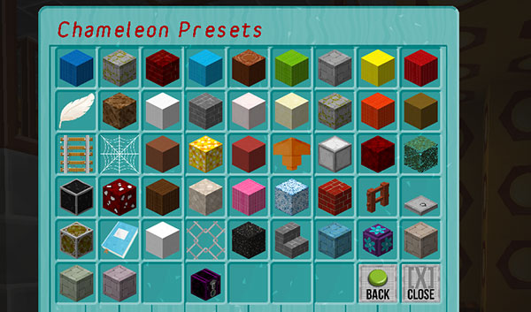

**ANGEL** — A weeping angel. Each time it materialises it wings can be either up or down, and its head faces a random direction.

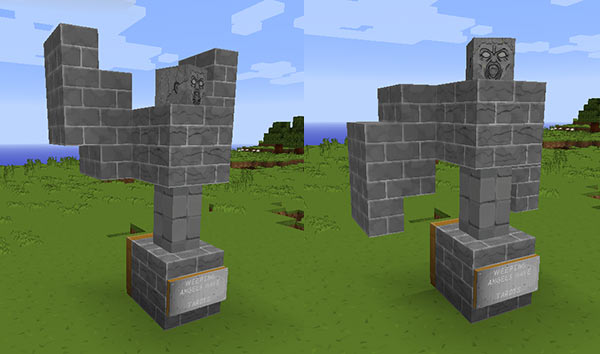

**APPERTURE** — An Apperture Science portal or two.

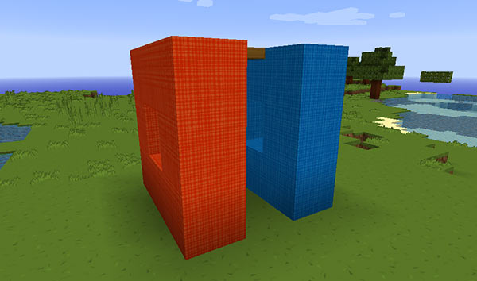

**CAKE** — A birthday cake.

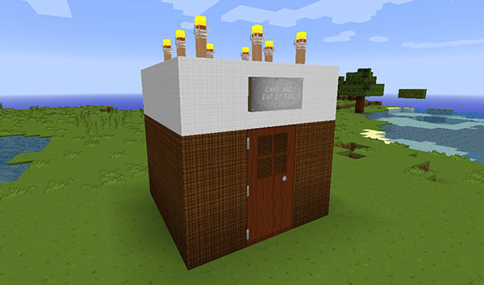

**CANDY** — A candy cane. Brush teeth after use.

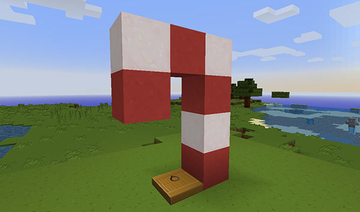

**CHALICE** — A quartz chalice. It has water in the top.

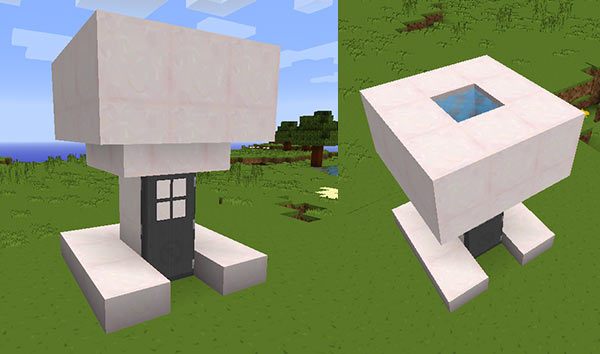

**CREEPY** — A creepy preset.

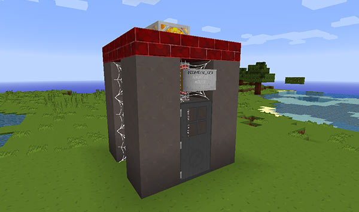

**DESERT** — A desert temple.

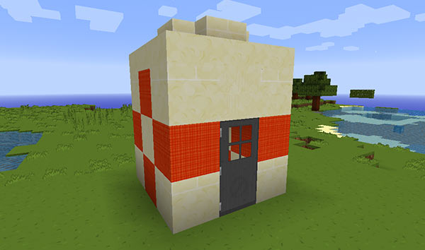

**DUCK** — Rubber ducky, you’re the one, you make bath time so much fun. Rubber ducky I’m awfully fond of you…

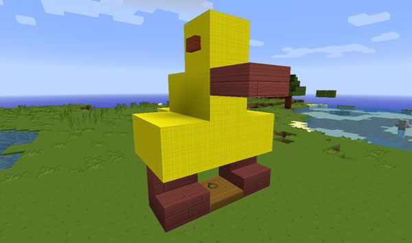

**FACTORY** — A factory fresh TARDIS, straight of the Gallifrean production line.

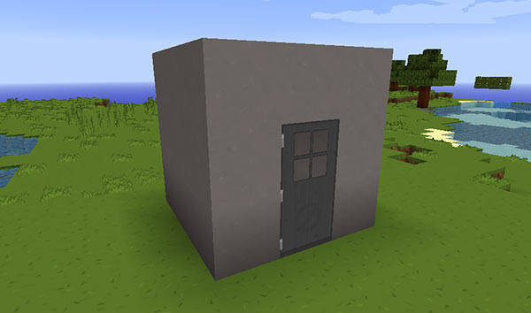

**FENCE** — A random fence.

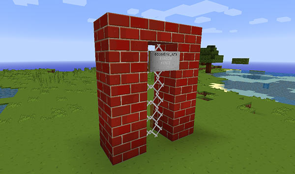

**FLOWER** — A flower. The petals on this preset turn a random colour each time it materialises.

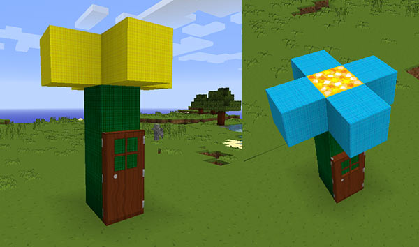

**GAZEBO** — A gazebo for your garden.

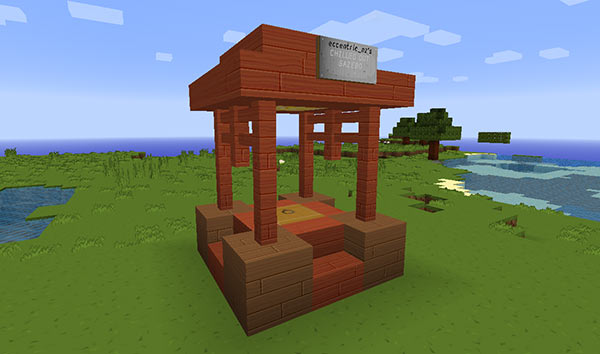

**GRAVESTONE** — Here lies a Time Lord.

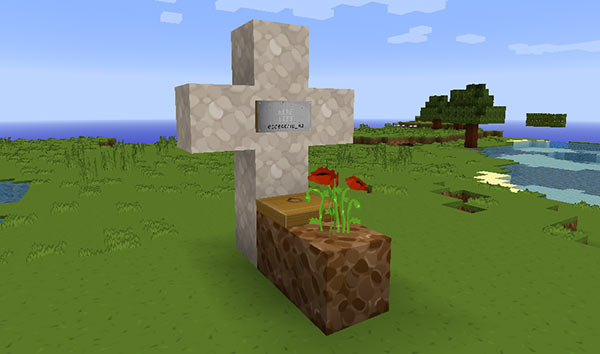

**HELIX** — A double helix.

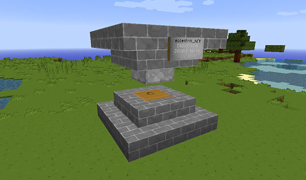

**JAIL** — Go directly to jail!

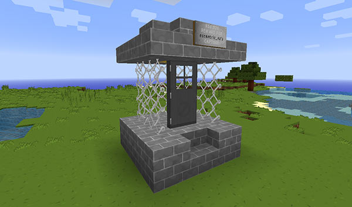

**JUNGLE** — A jungle temple.

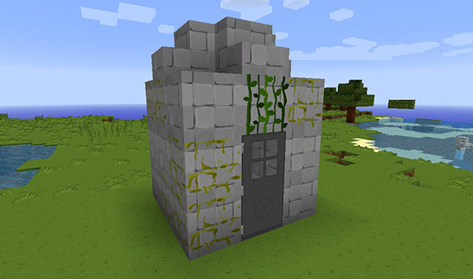

**LAMP** — A lamp post.

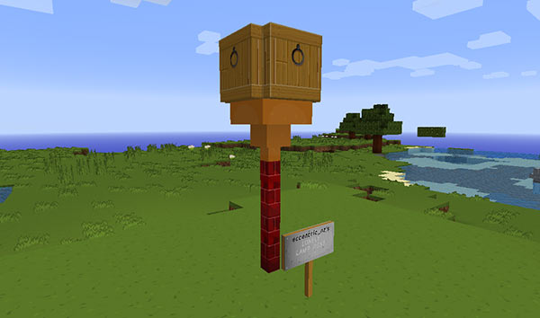

**LIBRARY** — A Time Lord’s library.

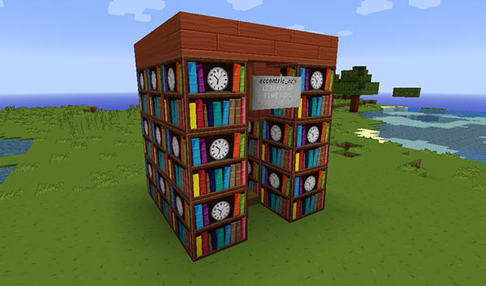

**LIGHTHOUSE** — A tiny lighthouse.

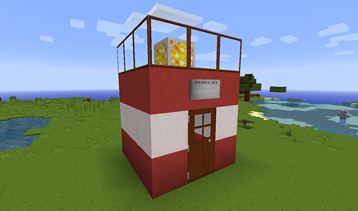

**MINESHAFT** — A mineshaft complete with torches and cobweb.

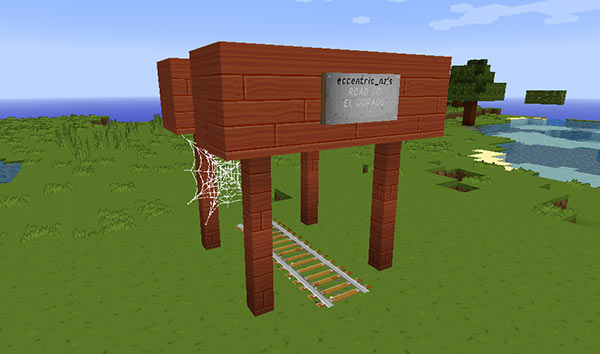

**NETHER** — A small nether fortress.

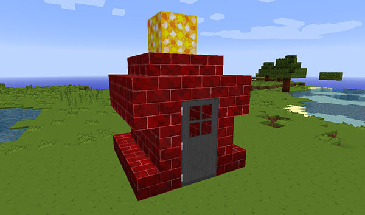

**NEW** — The new taller style Police Box. This is the default preset. If the Chameleon Circuit is ON, this will blend in with its surroundings.

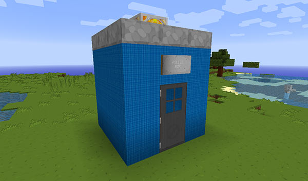

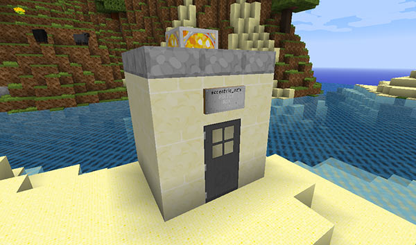

**OLD** — The old style Police Box from the early days of the plugin. If the Chameleon Circuit is ON, this will blend in with its surroundings.

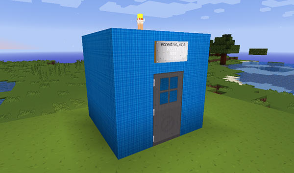

**PANDORICA** — The Pandorica.

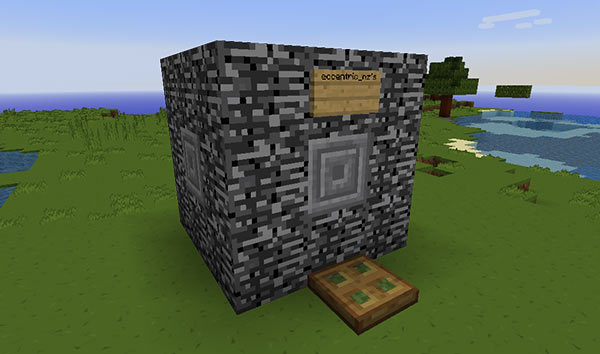

**PARTY** — A party tent. Bring on the disco sheep. This preset turns a random colour each time it materialises.

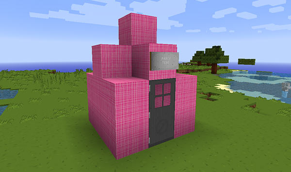

**PEANUT** — A peanut butter jar.

**PINE** — A snowy spruce tree.

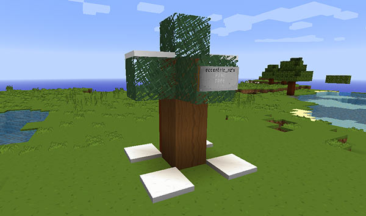

**PORTAL** — A nether portal.

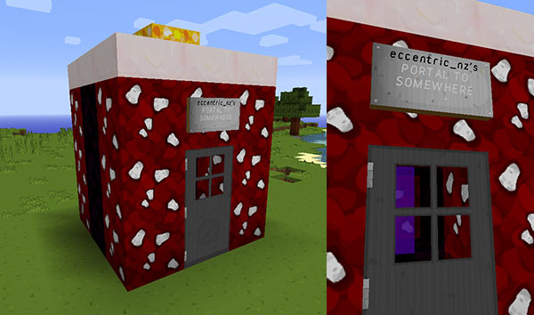

**PUNKED** — A steam punked exterior.

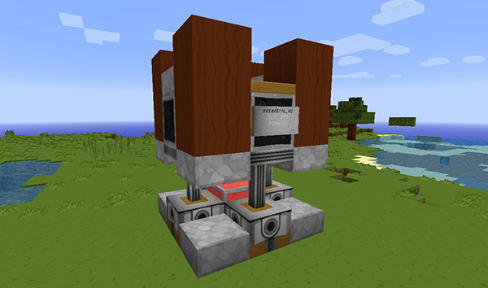

**ROBOT** — A robot with a head that faces a random direction.

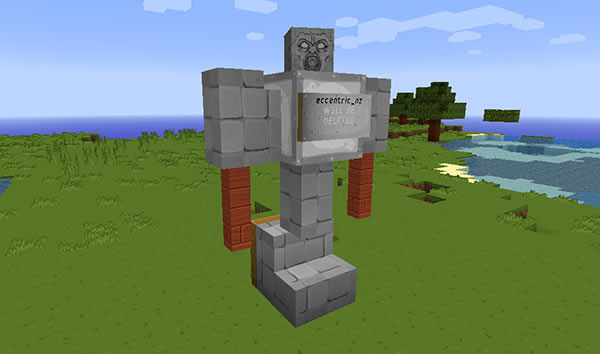

**SHROOM** — A brown mushroom.

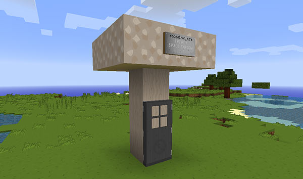

**SNOWMAN** — A snowman, takes one to snow one :)

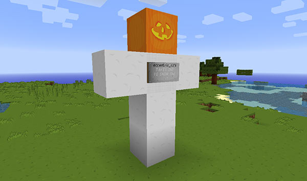

**STONE** — A stone brick column.

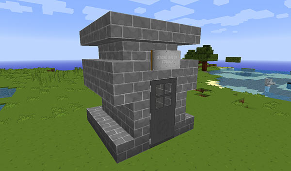

**SUBMERGED** — A partially submerged home. If the Chameleon Circuit is ON, this will blend in with its surroundings.

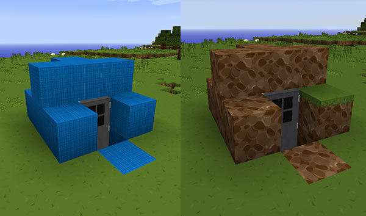

**SWAMP** — A swamp hut.

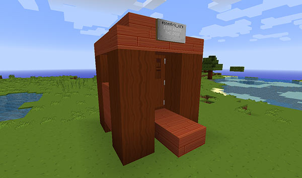

**TELEPHONE** — A red telephone box.

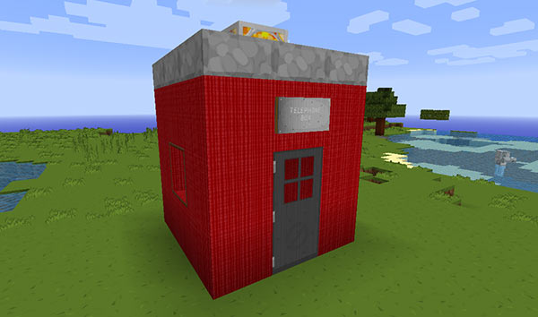

**TOILET** — A toilet, for when you just need to go…

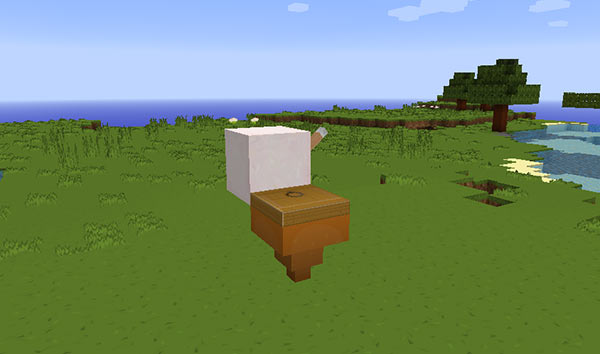

**TOPSYTURVEY** — An upside down Police Box.

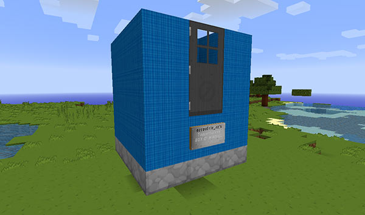

**TORCH** — A flaming torch. Be careful where you park!

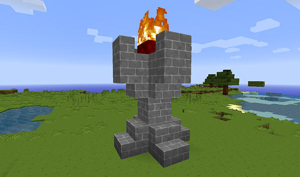

**VILLAGE** — A village house of stone and wood.

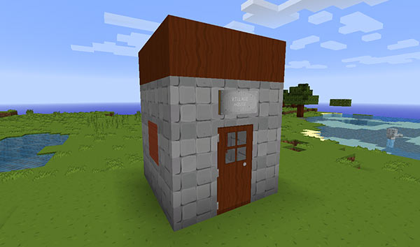

**WELL** — A mossy well, the door is inside the well.

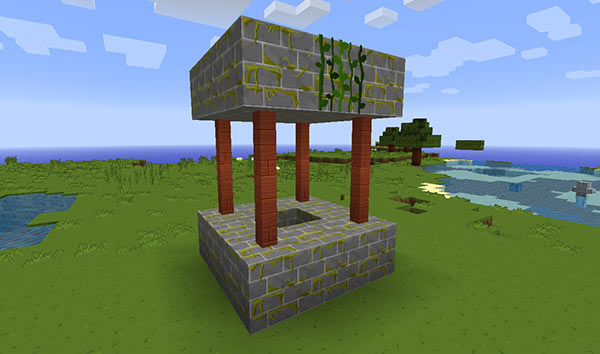

**WINDMILL** — A miniature windmill.

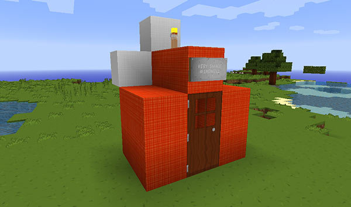

**YELLOW** — A yellow submarine.

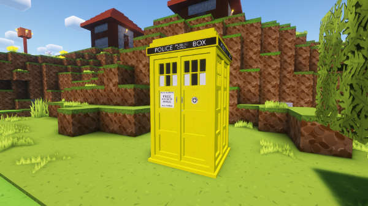
