# Chameleon Presets

Chameleon Presets can be selected and applied in the [Chameleon Circuit](chameleon-circuit.html) GUI. There are 64 presets in total on two pages, plus one special hidden preset, and one custom preset that server admins can set up themselves — see the [Custom preset page.](custom-preset.html)

## Page one

These presets use regular Minecraft blocks. When materialising they cycle through stained glass and regular glass for their animation.

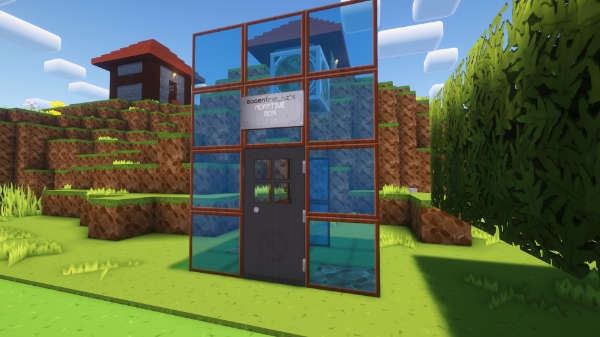

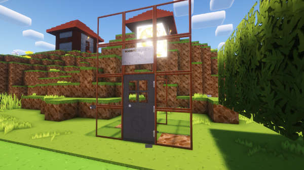

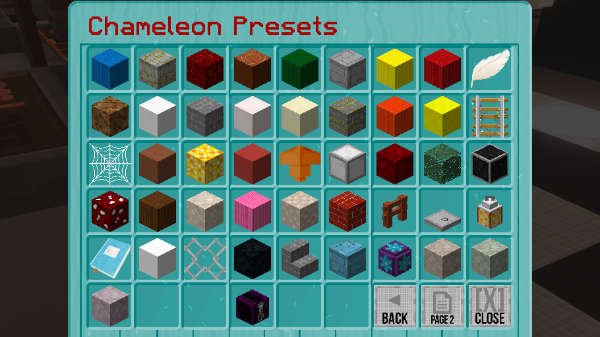

**ANGEL** — A weeping angel. Each time it materialises it wings can be either up or down, and its head faces a random direction.

**APPERTURE** — An Apperture Science portal or two.

**CAKE** — A birthday cake.

**CANDY** — A candy cane. Brush teeth after use.

**CHALICE** — A quartz chalice. It has water in the top.

**CREEPY** — A creepy preset.

**DESERT** — A desert temple.

**DUCK** — Rubber ducky, you’re the one, you make bath time so much fun. Rubber ducky I’m awfully fond of you…

**FACTORY** — A factory fresh TARDIS, straight of the Gallifrean production line.

**FENCE** — A random fence.

**FLOWER** — A flower. The petals on this preset turn a random colour each time it materialises.

**GAZEBO** — A gazebo for your garden.

**GRAVESTONE** — Here lies a Time Lord.

**HELIX** — A double helix.

**JAIL** — Go directly to jail!

**JUNGLE** — A jungle temple.

**LAMP** — A lamp post.

**LIBRARY** — A Time Lord’s library.

**LIGHTHOUSE** — A tiny lighthouse.

**MINESHAFT** — A mineshaft complete with torches and cobweb.

**NETHER** — A small nether fortress.

**NEW** — The new taller style Police Box. This is the default preset. If the Chameleon Circuit is ON, this will blend in with its surroundings.

**OLD** — The old style Police Box from the early days of the plugin. If the Chameleon Circuit is ON, this will blend in with its surroundings.

**PANDORICA** — The Pandorica.

**PARTY** — A party tent. Bring on the disco sheep. This preset turns a random colour each time it materialises.

**PEANUT** — A peanut butter jar.

**PINE** — A snowy spruce tree.

**PORTAL** — A nether portal.

**PUNKED** — A steam punked exterior.

**ROBOT** — A robot with a head that faces a random direction.

**SHROOM** — A brown mushroom.

**SNOWMAN** — A snowman, takes one to snow one :)

**STONE** — A stone brick column.

**SUBMERGED** — A partially submerged home. If the Chameleon Circuit is ON, this will blend in with its surroundings.

**SWAMP** — A swamp hut.

**TELEPHONE** — A red telephone box.

**TOILET** — A toilet, for when you just need to go…

**TOPSYTURVEY** — An upside down Police Box.

**TORCH** — A flaming torch. Be careful where you park!

**VILLAGE** — A village house of stone and wood.

**WELL** — A mossy well, the door is inside the well.

**WINDMILL** — A miniature windmill.

**YELLOW** — A yellow submarine.

## Page two

Page two contains mostly police box presets in all the Minecraft colours. All these presets use custom item models in an Item Frame. They have custom block models for the materialisation animation as well.

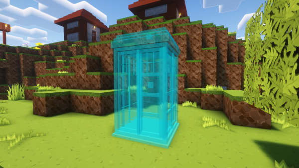

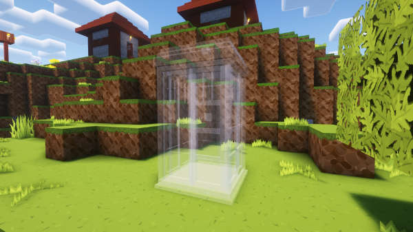

**POLICE\_BOX\_BLUE** — A standard blue police box.

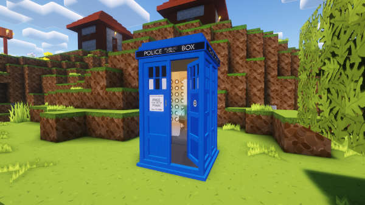

**POLICE\_BOX\_WHITE** — A white police box.

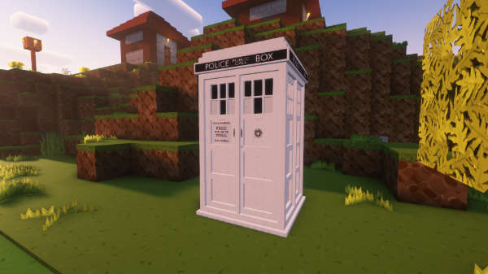

**POLICE\_BOX\_ORANGE** — An orange police box.

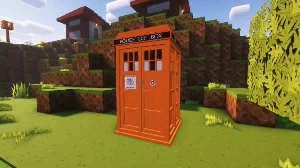

**POLICE\_BOX\_LIGHT\_BLUE** — A light blue police box.

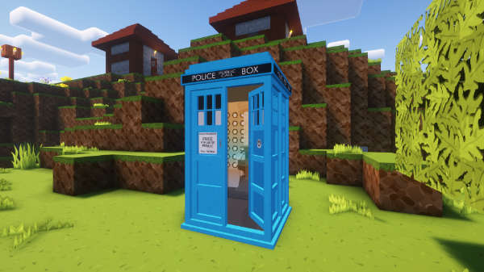

**POLICE\_BOX\_YELLOW** — A yellow police box.

**POLICE\_BOX\_LIME** — A lime police box.

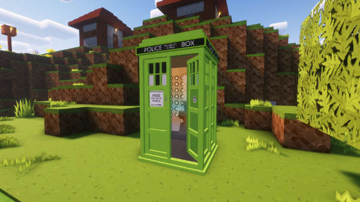

**POLICE\_BOX\_PINK** — A pink police box.

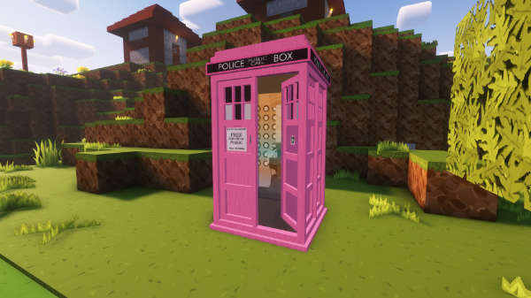

**POLICE\_BOX\_GRAY** — A gray police box.

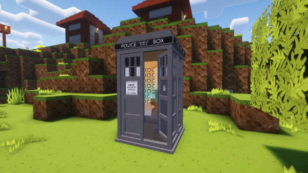

**POLICE\_BOX\_LIGHT\_GRAY** — A light gray police box.

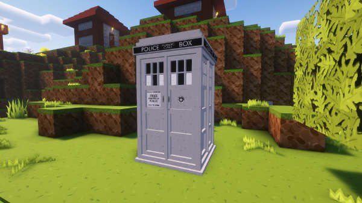

**POLICE\_BOX\_CYAN** — A cyan police box.

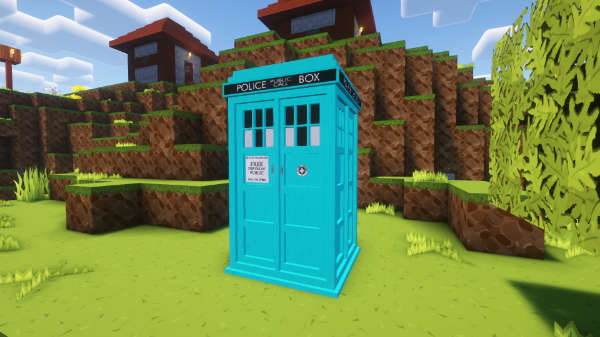

**POLICE\_BOX\_PURPLE** — A purple police box.

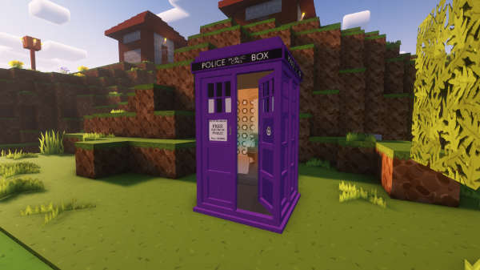

**POLICE\_BOX\_BROWN** — A brown police box.

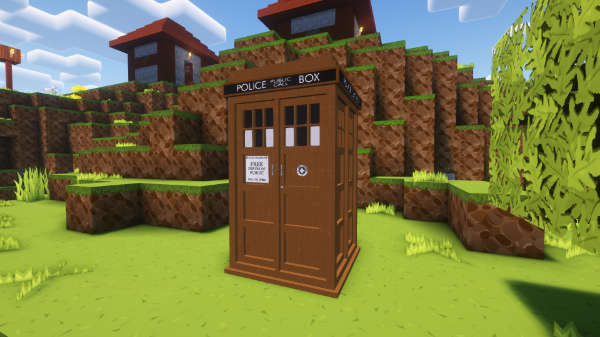

**POLICE\_BOX\_GREEN** — A green police box.

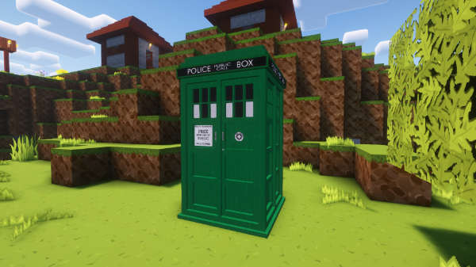

**POLICE\_BOX\_RED** — A red police box.

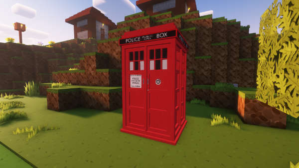

**POLICE\_BOX\_BLACK** — A black police box.

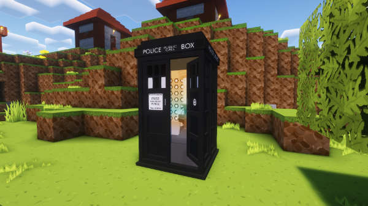

**WEEPING_ANGEL** — A weeping angel.

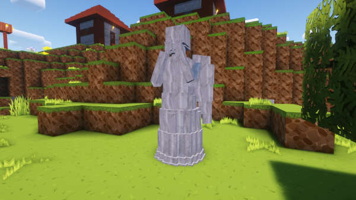
