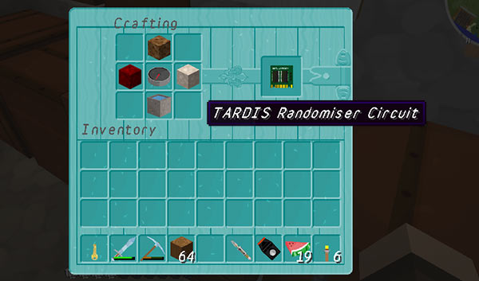

# Randomiser circuit

When inserted in the Advanced Console, the TARDIS attempts to find a completely random destination.

It picks a random world and random coordinates, whilst still respecting the places that a player has permission to go to...

It also uses more Artron Energy than regular random travel (using the repeaters and button) and disables the scanner until the TARDIS has landed.

### Recipe

DIRT, NETHERRACK, COMPASS, ENDER\_STONE, WATER\_BUCKET in shape shown below.



### Configuration

In _config.yml_:

```yaml
travel:
  random_circuit:
    x: 5000
    z: 5000
```

Maximum +/- number of blocks the random location search will look between in x and z directions, so default will be -5000 to 5000 in both x and z directions. If the WorldBorder plugin is installed or a vanilla world border is in use, then those settings will be used instead.

In _artron.yml_:
```yaml
random_circuit: 150
```
Sets the Artron Energy cost to use the circuit.
