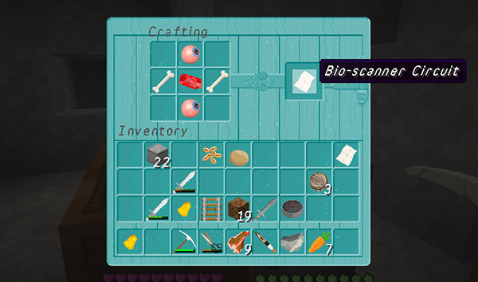

# The Recipe command

Don’t know the recipe for a TARDIS item? Use the recipe command!

    /tardisrecipe [item]

This command works the same way as the Essentials plugin `/recipe` command.

### Recipe command reference

Listed below is a selection of TARDIS items that you can craft. You can use the `/tardisrecipe list` command to see a categorised list of all items.

**Tip:** You can also use tab key completion to see a full list in-game.

| TARDIS seed blocks | `/tardisrecipe tardis [type]` |
| Server Admin Circuit | `/tardisrecipe a-circuit` |
| Bio-scanner Circuit | `/tardisrecipe bio-circuit` |
| Biome Storage Disk | `/tardisrecipe biome-disk` |
| Blank Storage Disk | `/tardisrecipe blank` |
| Chameleon Circuit | `/tardisrecipe c-circuit` |
| Diamond Disruptor Circuit | `/tardisrecipe d-circuit` |
| Emerald Environment Circuit | `/tardisrecipe e-circuit` |
| Perception Filter | `/tardisrecipe filter` |
| TARDIS Key | `/tardisrecipe key` |
| Locator Circuit | `/tardisrecipe l-circuit` |
| TARDIS Locator | `/tardisrecipe locator` |
| TARDIS Materialisation Circuit | `/tardisrecipe m-circuit` |
| Sonic Oscillator | `/tardisrecipe oscillator` |
| Player Storage Disk | `/tardisrecipe player-disk` |
| Preset Storage Disk | `/tardisrecipe preset-disk` |
| Perception Circuit | `/tardisrecipe p-circuit` |
| Redstone Activator Circuit | `/tardisrecipe r-circuit` |
| TARDIS Remote key | `/tardisrecipe r-key` |
| Stattenheim Remote | `/tardisrecipe remote` |
| Stattenheim Circuit | `/tardisrecipe s-circuit` |
| Save Storage Disk | `/tardisrecipe save-disk` |
| Sonic Screwdriver | `/tardisrecipe sonic` |

