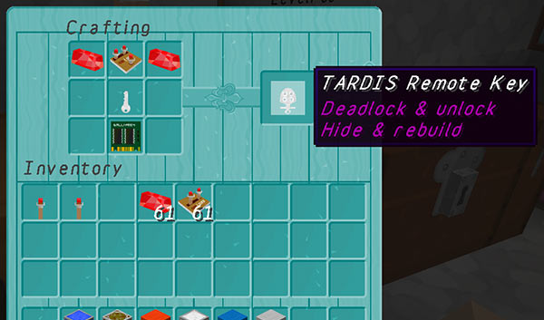

[Jump to video](#video)

# TARDIS Remote key

The Tenth Doctor installed a system that allowed him to lock the TARDIS remotely using a key remote (as a joke, the TARDIS roof light flashed and a alarm chirp sound was heard, similar to that used on vehicles on Earth). In TARDIS v3.0-beta-1 and later, you can craft a remote key to do this too.

To see the recipe type:

    /tardisrecipe r-key

In plugins version \< v3.2.8, the recipe will show a GOLD\_NUGGET — **_you will actually have to use a crafted TARDIS Key._**

**NOTE:** If you have changed the item that crafting the TARDIS Key gives (i.e. it is NOT a GOLD\_NUGGET), then make sure you also update the TARDIS Remote Key recipe so that the GOLD\_NUGGET/TARDIS Key **ingredient is also changed**.

Not only does the remote key deadlock and unlock the Police Box door, but it also allows you to show and hide the TARDIS as well.

### Remote (un)locking

To remotely lock and unlock the door, LEFT-click AIR with the TARDIS Remote Key.

You will hear a ‘car alarm chirp’ and the TARDIS lamp will turn off an on.

### Remote hide and rebuild

To remotely hide and rebuild the TARDIS, RIGHT-click AIR with the TARDIS Remote Key.

You must have sufficient Artron energy (and the correct permissions).

### Video
<iframe width="600" height="366" src="https://www.youtube.com/embed/MgcADd8FhYA?rel=0" frameborder="0" allowfullscreen></iframe>