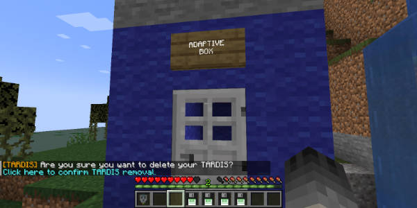

# Removing the TARDIS

To delete your TARDIS use the command `/tardis exterminate`. You will be asked to confirm your decision by clicking a
link in chat. After clicking the link, your TARDIS will be permanently deleted.

**WARNING:** You will lose any items you have stored in your TARDIS; all rooms, and any saved time travel destinations (
unless stored within the [TARDIS Disk Storage Container](advanced-console.html#storage_info)) will be removed.

### Prior to version 4.7.0

To delete your TARDIS, you break the sign above the door of the TARDIS Police Box.

The default TARDIS exterior is initially set to the "FACTORY" preset without a sign above the door - you may have to use
the Chameleon Circuit GUI to change it to a Police Box with a sign first.

**Note:** As of version `2.7` the TARDIS Chameleon Circuit is no longer required to be set to a Police Box preset. Any
sign on your TARDIS can be broken to delete it.

You will be asked to confirm the TARDIS deletion with a command. Type:

    /tardis exterminate

To confirm the deletion.
