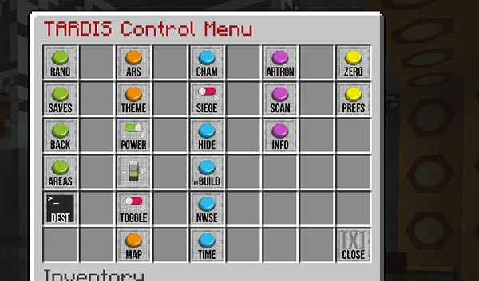

# Resource Packs

## Textures and sounds

Use the TARDIS-Resource-Pack found here:

[https://github.com/eccentricdevotion/TARDIS-Resource-Pack](https://github.com/eccentricdevotion/TARDIS-Resource-Pack)

or here:

[http://tardisjenkins.duckdns.org:8080/job/TARDIS-Resource-Pack/](http://tardisjenkins.duckdns.org:8080/job/TARDIS-Resource-Pack/)

## Sounds only

Use the TARDIS-Sound-Resource-Pack found here:

[https://github.com/eccentricdevotion/TARDIS-SoundResourcePack](https://github.com/eccentricdevotion/TARDIS-SoundResourcePack)

or here:

[http://tardisjenkins.duckdns.org:8080/job/TARDIS-SoundResourcePack/](http://tardisjenkins.duckdns.org:8080/job/TARDIS-SoundResourcePack/)

## TARDIS Weeping Angels

These are included in the TARDIS-Resource-Pack, but if you are running TWA independently or don't want the other TARDIS
textures, you can use TARDIS
Use the TARDIS-Sound-Resource-Pack found here:

[https://github.com/eccentricdevotion/TARDISWeepingAngels-Resource-Pack](https://github.com/eccentricdevotion/TARDISWeepingAngels-Resource-Pack)

or here:

[http://tardisjenkins.duckdns.org:8080/job/TARDISWeepingAngels-Resource-Pack/](http://tardisjenkins.duckdns.org:8080/job/TARDISWeepingAngels-Resource-Pack/)

### Keeping the resource packs up-to-date

The TARDIS resource packs are shared in GitHub repositories. If you install a GitHub client, you can easily keep your
resource packs current by syncing with any changes that are pushed to the repository.

Here’s a quick run down on doing that:

1. Download and install the GitHub client for your operating system:

- [GitHub for Mac](https://mac.github.com/)
- [GitHub for Windows](https://windows.github.com/)

2. Start GitHub client and create a free GitHub account (if you don’t have one)
3. In your web browser, naviagte to the TARDIS resource pack repositories

- [TARDIS-MCP](https://github.com/eccentricdevotion/TARDIS-MCP)
- [TARDIS-Sounds](https://github.com/eccentricdevotion/TARDIS-SoundResourcePack)

4. Click the **Clone in Desktop** button
5. Save the repository clone in the _minecraft/resourcepacks_ folder
6. Repeat steps 4 and 5 for each resource pack
7. To update the resource pack, use the desktop client to ‘Pull’ in any changes.

- `Command-Shift-P` on a Mac
- `Control-Shift-P` on Windows
