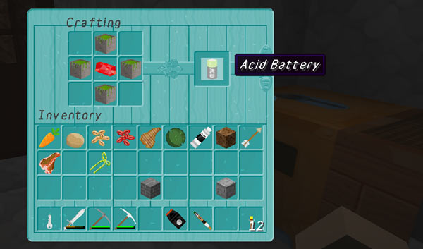
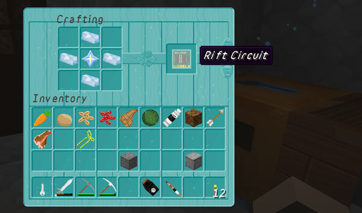
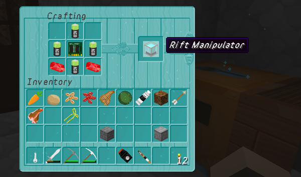

# Rift Manipulator

**Note:** The Rift Manipulator can only be obtained if the Skaro planet is enabled, and _map\_1983.dat_ is installed in the server’s main world folder, so that players can craft a Rift Circuit.

Permission: `tardis.rift`

Rift Manipulators can be used by players to set up personal TARDIS rechargers. These work in the same way as server admin configured rechargers.

Rift Manipulator are powered by Acid Batteries and the Rift Circuit. To see the crafting recipes for the required items use the commands below:

    /tardisrecipe acid-battery
    /tardisrecipe rift-circuit
    /tardisrecipe rift-manipulator

Any player can craft the items, but only those with the correct permission can activate the Rift Manipulator. This is done by simply placing the block where you want it. Breaking the block can only be done by the player who placed it (the Rift Manipulator is returned).

Rift rechargers are NOT listed with the `/tardis list rechargers` command.

