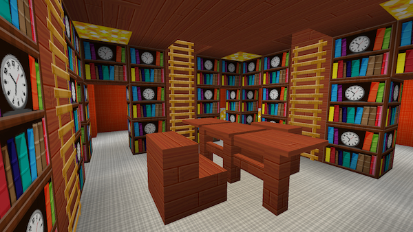

[Back](javascript:history.back();)

# Room gallery

## Table of Contents

This list is in alphabetical order.

- [4th Doctor's Secondary Console](#secondary-console-baker)
- [Anti-gravity Well](#anti-gravity-well)
- [Apiary](#apiary)
- [Aquarium](#aquarium)
- [Arboretum](#arboretum)
- [Bamboo](#bamboo)
- [Bedroom](#bedroom)
- [Bird Cage](#bird-cage)
- [Chemistry Lab](#chemistry-lab)
- [Empty](#empty)
- [Exterior Renderer](#exterior-rendering-room-before-render)
- [Eye of Harmony](#eye-of-harmony)
- [Genetic Manipulator](#genetic-manipulator)
- [Gravity Well](#gravity-well)
- [Greenhouse](#greenhouse)
- [Horse Stable](#horse-stable)
- [Igloo](#igloo)
- [Kitchen](#kitchen)
- [Library](#library)
- [Llama Stall](#llama-stall)
- [Mob Farm](#mob-farm)
- [Mycelium](#mushroom)
- [Passage](#passage)
- [Pool](#pool)
- [Rabbit Hutch](#rabbit-hutch)
- [Rail Transfer System](#rail-transport-room)
- [Shell](#shell)
- [Smelter](#smelter)
- [Storage Vault](#vault)
- [Trenzalore](#trenzalore)
- [Village](#village)
- [Wood Secondary Console](#secondary-console-wood)
- [Workshop](#workshop)

#### Aquarium

#### Arboretum

#### Apiary

#### Bamboo

#### Bedroom

#### Bird Cage

#### Chemistry Lab

#### Empty

#### Exterior Rendering Room (Before render)

#### Exterior Rendering Room (Example render)

#### Eye of Harmony

#### Farm

#### Genetic Manipulator

#### Gravity well

#### Anti-Gravity well

#### Greenhouse

#### Horse Stable

#### Igloo

#### Kitchen

#### Library

#### Llama Stall

#### Mob Farm

#### Mushroom

#### Passage

#### Pool

#### Rabbit Hutch

#### Rail Transport Room

#### Secondary console (Baker)

#### Secondary console (Wood)

#### Shell

#### Smelter

#### Trenzalore

#### Vault

#### Village

#### Workshop

#### Zero Room

## Deprecated Rooms

#### Cross roads

Deprecated in TARDIS version 2.6-beta-1

#### Passage (old)

Deprecated in TARDIS version 2.6-beta-1

#### Passage (long)

Deprecated in TARDIS version 2.6-beta-1

[Back](javascript:history.back();)
