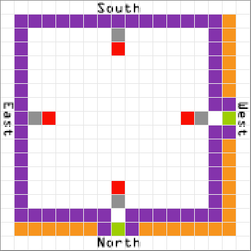
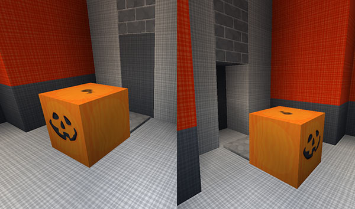
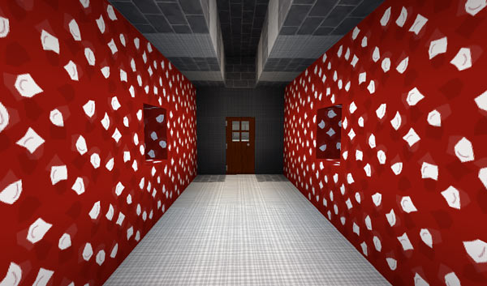
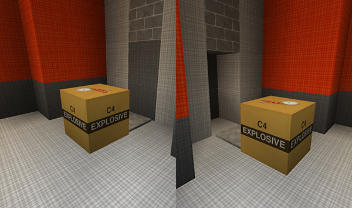

[Jump to videos](#video)

[Visit the room gallery](room-gallery.html)

# Rooms

**Note:** This feature has changed significantly as of TARDIS version 2.6-beta-1! It requires:

- `create_worlds: true` in the config, and a multi-world plugin
- OR
- a special world called _TARDIS\_TimeVortex_ — to learn how to set this up visit the [Time Vortex](time-vortex.html) page

## Growing rooms

As of TARDIS v2.6 it is **recommended** that you use the [Architectural Reconfiguration System](ars.html) to grow rooms.

You can create rooms in your TARDIS. Each room costs a varying amount of Artron Energy. All rooms and the main TARDIS console have automatic piston doors. **If your TARDIS doesn’t have these:**

- make sure the plugin is up to date
- read **all** the [change logs](change-log.html) for the various 2.6 versions
- stop the server
- delete _plugins/TARDIS/schematics_ and _plugins/TARDIS/rooms.yml_
- start the server
- delete your old TARDIS
- make a new TARDIS

To create a room, you place the required material (the seed) in front of the stone pressure plate that triggers the opeining of the piston door — refer to the diagram below (seed blocks are marked in red):

Use the command:

    /tardis room [room type]

and follow the instructions. The room types and their corresponding seed blocks are as follows:

    Aquarium - TUBE_CORAL_BLOCK
    Arboretum - OAK_LEAVES
    Baker - END_STONE
    Bedroom - GLOWSTONE
    Birdcage - YELLOW_GLAZED_TERRACOTTA
    Empty - GLASS
    Eye of Harmony - STONE_BRICK_STAIRS
    Farm - DIRT
    Gravity Well - MOSSY_COBBLESTONE
    Anti-Gravity Well - SANDSTONE
    Greenhouse - MELON
    Hutch - ACACIA_LOG
    Igloo - PACKED_ICE
    Kitchen - PUMPKIN
    Lazarus - FURNACE
    Library - ENCHANTING_TABLE
    Mushroom - GRAVEL
    Passage - CLAY
    Pool - SNOW_BLOCK
    Rail - HOPPER
    Renderer - TERRACOTTA
    Secondary Console - END_STONE/OAK_PLANKS (for Baker/Wood consoles, respectively)
    Shell - DEAD_BRAIN_CORAL_BLOCK
    Smelter - CHEST
    Stable - HAY_BLOCK
    Stall - NETHER_WART_BLOCK
    Trenzalore - BRICKS
    Vault - DISPENSER
    Village - OAK_LOG
    Wood - OAK_PLANKS
    Workshop - RED_NETHER_BRICKS
    Zero Room - N/A

### Notes:

- More information about the `Lazarus` room can be found on the [TARDIS Genetic Manipulator page](lazarus.html)
- More information about the `Renderer` room can be found on the [Scanner page](scanner.html#renderer)
- More information about the `Zero` room can be found on the [Zero Room page](zero-room.html)
- More information about `Gravity Well` rooms can be found on the [Gravity Wells page](gravity-wells.html)
- The _Eye of Harmony_ room type is `harmony`
- The _gravity well_ room type is `gravity` and requires an empty ARS room slot **above** the room as well.
- The _anti gravity well_ room type is `antigravity` and requires an empty ARS room slot **below** the room as well.
- The secondary console room types are: `baker` and `wood`

Once the room is finished generating, a confirmation message will be shown.

### Changing the room wall block

By default (most) room walls are ORANGE wool. If you would like to replace all the ORANGE wool blocks with another material, you can set a wall player preference **before** growing the room.

To see a list of available wall materials, see the [walls page](walls.html), or type:

    /tardisprefs wall help

To set your wall block preference, type:

    /tardisprefs wall [material]

Where `[material]` is a block from the wall help list, e.g:

    /tardisprefs wall huge_mushroom_2

The next room you grow (if it normally contains ORANGE wool) will have the blocks replaced with your preference.

### Changing the floor block

Similar to the wall player preference, there is also a floor player preference. If you would like to replace all the LIGHT GREY wool blocks (the default for room floors) with another material, you can set the floor player preference **before** growing the room. Use:

    /tardisprefs floor [material]

## Removing rooms

Rooms may also be removed (or in TARDIS terms — jettisoned).

Simply place TNT in the same seed location as when you grew the room and use the command:

    /tardis jettison [room type]

Then follow the onscreen instructions.

## Gravity wells

TARDIS gravity wells let you travel in any direction without having to walk. You can grow a gravity well that goes down, and an anti-gravity well that goes up. This allows you to expand the TARDIS interior over as many levels as you desire. Using the `/tardisgravity` command you can also create ‘sideways’ gravity wells.

Visit the [gravity wells page](gravity-wells.html) for more specific information.

## Vault room

As of TARDIS v3.1-beta-1 the Vault room will automatically sort items into the chests contained within it.

For more information see: [Vault room](vault.html)

### Videos
<iframe src="https://player.vimeo.com/video/57807692" width="600" height="366" frameborder="0" webkitallowfullscreen mozallowfullscreen allowfullscreen></iframe><iframe src="https://player.vimeo.com/video/59827634" width="600" height="366" frameborder="0" webkitallowfullscreen mozallowfullscreen allowfullscreen></iframe>
