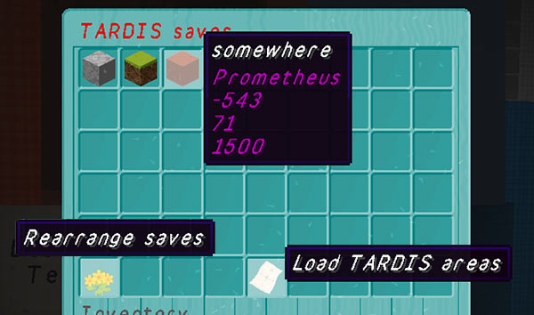

# Save Sign

If you have saved a travel location using the `/tardis save [save_name]` command, or the server admin has set up some TARDIS Areas, you can time travel to them in the TARDIS by using the Save Sign GUI.

The Save Sign is automatically added to new TARDISes. You can destroy and place it at a new location by using the `/tardis update save-sign` command.

To use the Save Sign, right-click it to open the inventory based GUI.

By default the first item in the GUI is the TARDIS’s “home” location. After that come any locations that you have saved. Hovering over the blocks will show you the save name, world name and coordinates.

To travel to a saved location, simply click a block.

### Rearranging saves

In later versions of the plugin, saves can be rearranged into your preferred order. To do this, click the bottom left block called “Rearrange saves” then move the saves into their desired positions. You cannot rearrange the “home” location block.

Close the Save Sign GUI to keep the arrangement.

### Switching to TARDIS Areas

The bottom middle block in the Save Sign GUI lets you switch to the TARDIS Areas screen. Any areas set up by the server administrator (and that you have permission for) will be shown here. To go to the location, click the block just like you would for a save.

