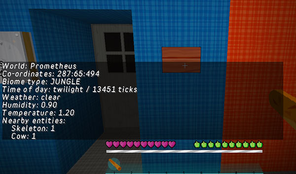

[Jump to videos](#video)

# Environment scanner

You can add a button or lever to the TARDIS that lets you scan the environment around the TARDIS Police Box.

Place the block where you want the scanner to be positioned, and the run the command:

    /tardis update scanner

Follow the onscreen instructions.

## Use

To use the scanner, simply click the button/lever.

The scanner will show information for the current location of the TARDIS Police Box, or, if a destination has been set, the next travel location.

You will be able to see the following information:

- World & co-ordinates
- Biome type
- Time of day
- Weather conditions
- Humidity & temperature
- Nearby entities

# Exterior Rendering Room

If you have grown a `Renderer` room, you are also shown a view of the immediate area around your TARDIS upon activating the scanner.

You will be teleported into the room after the textual readout from the scanner has completed. The room consists of a glass representation of your TARDIS, as well as a view of the immediate area around your travel device. Any water is rendered as light blue stained glass, and lava as orange wool.

### Videos
<iframe src="https://player.vimeo.com/video/82703002" width="600" height="366" frameborder="0" webkitallowfullscreen mozallowfullscreen allowfullscreen></iframe>