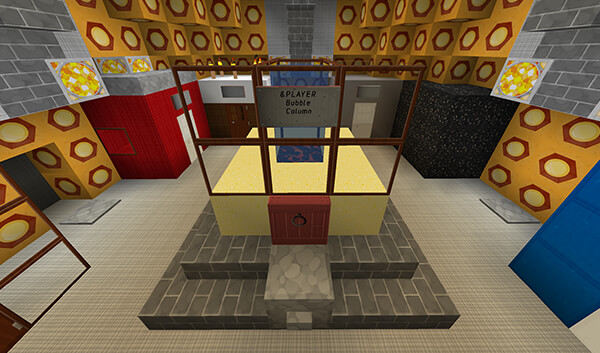
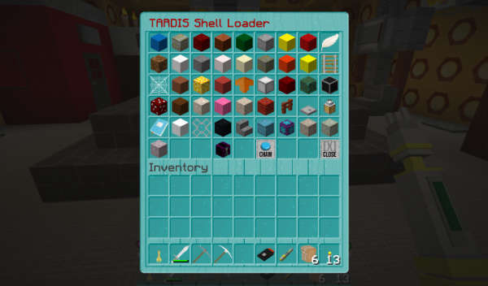

# The Shell Room

In the Whoniverse, the shell room is an area in the TARDIS where plasmic shells are stored. The chameleon circuit picks
the most suitable shell from the room and applies it as the ship’s exterior.

You can use the shell room to construct your own custom chameleon design (make sure you grow the room first).

Place blocks from your inventory onto the platform. The door should be on the side with the stone slab sticking out.

You construct the chameleon shell in the same way as the server’s [custom preset](custom-preset.html).

- The minimum requirement is one block and a door.
- The maximum size is 3 block wide x 3 blocks deep x 4 blocks high.
- You can add a sign on the side with the stone slab sticking out. Text on the sign will be saved with the construct.
  You can use `&PLAYER` as a placeholder for the player’s name.

To save the chameleon construct, click the stone button on the platform.

## Shell Loader

You can enable and disable the Shell Loader in the TARDIS configuration using the
command `/tardisconfig load_shells [true|false]`. _When enabling, a server restart is required._

If players have the permission `tardis.load_shells`, they can load Chameleon presets into the Shell room.

To open the Shell Loader GUI, click the stone button on the Shell Constructor platform while sneaking.

Click a button to load the Chameleon preset onto the shell constructor platform.
