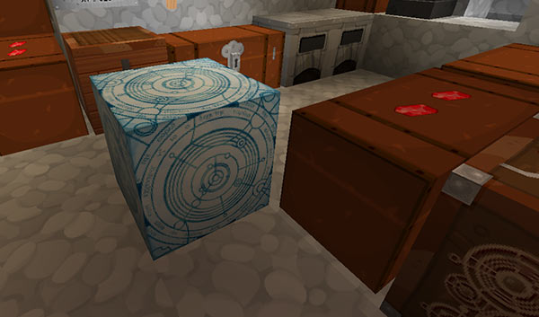

sacrificed---
layout: default
title: Siege mode
---

# Siege mode

As of TARDIS version 3.2 the plugin allows you to engage Siege mode on your TARDIS. You can read more about Siege mode at the [TARDIS wikia](http://tardis.wikia.com/wiki/Siege_mode).

To engage Siege mode you need to add a lever to the console. To do this you can use the `/tardis update siege` command.

## How it works

When you engage Siege mode the following will happen:

- Entry and exit of the TARDIS will no longer be possible
- Time travel in the TARDIS will no longer be possible
- Most other TARDIS functions will be disabled
- The TARDIS exterior will transform into a Siege Cube

While in Siege mode, the TARDIS is geared for and ONLY FOR the survival of the people inside the TARDIS. Depending on the configuration settings, this means:

- All healing in the TARIDS is boosted a little bit
- Food grows faster in this state
- Animals have a chance of having twins instead of a single birth
- All negative mobs in the TARDIS are butchered
- The desktop theme is changed to a dark wool version
- The Artron reserves are slowly depleted to support the Siege mode
- The Artron creeper is sacrificed for the good of the TARDIS, and gives an amount of Artron energy

All these features can be configured, see details below.

## Configuration

_config.yml_ contains a `siege` configuration section with the following defaults:

    siege:
        enabled: true
        breeding: 0
        growth: 0
        butcher: false
        creeper: false
        healing: false
        texture: false

The settings are explained below:

- `enabled: [true|false]` — whether players can engage Siege mode
- `breeding: [percentage]` — if this is set higher than 0, this is the percentage chance that twins will be born when animals breed
- `growth: [percentage]` — if this is set higher than 0, this is the percentage chance that a plant will sprout an extra step when it grows
- `butcher: [true|false]` — whether any hostile mobs inside the TARDIS will be butchered when Siege mode is engaged
- `creeper: [true|false]` — whether (when the TARDIS runs out of energy) the Artron creeper will be sacrificed to give the TARDIS an energy boost
- `healing: [true|false]` — whether players inside the TARDIS receive a healing pick-me-up
- `texture: [true|false]` — whether the desktop theme is changed when Siege mode is engaged

### Siege mode Artron settings

The default Artron settings for Siege mode are shown below:

    siege_transfer: 10
    siege_deplete: 100
    siege_creeper: 150
    siege_ticks: 1500

- `siege_deplete: [percentage]` — the percentage of maximum (`full_charge`) energy the TARDIS needs to be able to disengage Siege mode. Also the minimum amount of energy that can be transferred to the TARDIS by clicking the Siege Cube
- `siege_deplete: [amount]` — the amount of energy the TARDIS loses every cycle it is in Siege mode
- `siege_ticks: [ticks]` — the time cycle in ticks, the plugin will deplete energy from the TARDIS / heal players while in Siege mode
- `siege_creeper: [amount]` — the amount of energy boost the TARDIS gets when the Artron creeper is sacrificed

## The Siege Cube

The Siege Cube replaces the Police Box when Siege mode is engaged. The Time Lord and any companions of the TARDIS can mine the Siege Cube and carry it around with them in their inventory. While as an _item_, the Siege Cube is indestructible.

If the player drops the Siege Cube on the ground, and there is sufficient room for a Police Box to materialise, the Siege Cube will turn back into a block again.

### Transferring energy to the Siege Cube

If a player (the Time Lord or companion) RIGHT-clicks the Siege Cube some of their Time Lord energy will be transferred into the TARDIS. The player must have the configured percentage of full charge in order to do this.

The Artron Condensers, both the interior one and the server condenser (if setup) will also work as normal while the TARDIS is in Siege mode.

### Disengaging Siege mode

Siege mode can be disengaged in three ways. All require the TARDIS to have enough energy.

1. Toggle the Siege mode on and off using the button in the Control Centre GUI
2. Toggle the Siege mode lever inside the TARDIS (if you have one)
3. SHIFT-RIGHT-click the Siege Cube from the outside

### Lost Siege Cube / broken Siege mode

Server admins can restore a TARDIS in siege mode back to its normal state with the command:.

    /tardisadmin desiege [player]

The player must be online when running the command, and the TARDIS will be restored back to its ‘home’ location.

**Note:** the TARDIS Siege Cube block is a huge brown mushroom with the texture on all sides. As such it is recommended that players use the [TARDIS-MCP Resource Pack](https://github.com/eccentricdevotion/TARDIS-MCP) so that it looks the part and can be distinguished easily.
