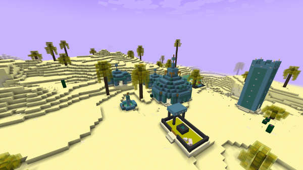

# Planet Skaro



- This world is limited to Desert, Mesa and Ocean biomes.
- If configured, all water is acid and will harm / kill the player (wearing armour reduces the effect). Use a boat!
- Dalek structures will generate automatically as you explore the world — there are currently two building types, a big main building and a smaller corridor type one.
- Daleks will spawn in the big main buildings — you will need to have TARDISWeepingAngels plugin installed and the TARDISWeepingAngels-Resource-Pack to see them properly. There is a 10% chance that a Dalek will spawn flying in the air.
- A random loot chest is located in the main Dalek building — wear plenty of armour if you want to raid these!
- You can fill Acid Buckets and Rust Buckets by using an empty bucket on water and lava. Acid Buckets can be used to make Acid Batteries, which in turn can be used to make [Rift Manipulators](rift-manipulator.html). Rust Buckets are used in the crafting recipe for the [Rust Plague](http://tardis.wikia.com/wiki/Rust_plague) Sword - this deals more damage to Daleks (Update the TARDIS-MCP resource pack to see the textures).

## Enabling Skaro

The new Skaro Dalek homeworld is disabled by default, here are some instructions on enabling it.

### Minimum requirements

- [Spigot 1.10](https://www.spigotmc.org/threads/spigot-craftbukkit-bungeecord-1-10.154136/)
- [TARDIS v3.6-beta-1](http://tardisjenkins.duckdns.org:8080/job/TARDIS/lastSuccessfulBuild/me.eccentric_nz.TARDIS%24TARDIS/) (build #1499 or higher)
- [Multiverse-Core v2.5](https://ci.onarandombox.com/view/Multiverse/job/Multiverse-Core/)

### Optional (but recommended) requirements

- [TARDISWeepingAngels v2.3](http://tardisjenkins.duckdns.org:8080/job/TARDISWeepingAngels/lastSuccessfulBuild/me.eccentric_nz.tardisweepingangels%24TARDISWeepingAngels/) (build #71 or higher)
- [TARDISWeepingAngels-ResourcePack](https://github.com/eccentricdevotion/TARDISWeepingAngels-Resource-Pack)
- [LibsDisguises v9.0.7](https://www.spigotmc.org/resources/libs-disguises.81/) (required by TARDISWeepingAngels)
- [ProtocolLib v4.0.2](https://www.spigotmc.org/resources/protocollib.1997/) (required by LibsDisguises)

### Step-by-step instructions

1. Install the plugin versions above
2. Start the server so that the default plugin files are generated
3. Stop the server
4. Edit the "Skaro" Planet in the TARDIS planets.yml file (found in the _plugins/TARDIS/_ folder). Example:

```yaml
    Skaro:
        enabled: false
        resource_pack: https://dl.dropboxusercontent.com/u/53758864/rp/Skaro.zip
        acid: true
        acid_damage: 5
        acid_potions:
        — WEAKNESS
        — POISON
        rust: true
    TARDIS_TimeVortex:
        resource_pack: default
```

### Configuration Breakdown

`enabled: [true|false]` — whether this world should be created and managed by TARDIS.

`resource_pack: https://dl.dropboxusercontent.com/u/53758864/rp/Skaro.zip` — this is where you specify the URL to the resource pack you want to switch to when entering the world. Host your own, or use the one provided.

`acid: [true|false]` — whether all the water in the world is acid (and harms the player).

`acid_damage: [amount]` — the amount of damage a player takes when in acid water.

`acid_potions: []` — optional list of potion effects to give the player when they are in acid water. You can add any potion types from the list here: [Bukkit PotionType Enum](https://hub.spigotmc.org/javadocs/bukkit/org/bukkit/potion/PotionType.html).

`rust: [true|false]` — whether rust is enabled (not actually used yet).

(To view more configuration options in planets.yml, go [here](configuration-planets))

### Step-by-step instructions (continued...)

1. Set, at a minimum, `planets: Skaro: enabled: true`, to use resource pack switching set `switch_resource_packs: true`
2. Start the server
