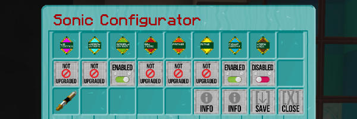

# Sonic Configurator

Once upgraded, you can configure your Sonic Screwdriver and turn on and off the upgrades at any time.

To open the Sonic Configurator, right-click AIR with the Sonic Screwdriver to open the Player Pref Menu GUI. Click on
the Config button to access the configuation GUI.

* To configure your sonic, place it in the bottom left slot.
* Click on the upgades you want to enable/disable. Hover over the top row icons to see the upgrade names.
* Click the _Save_ button to apply your selections.
* Click the _Close_ button to exit the menu without saving.