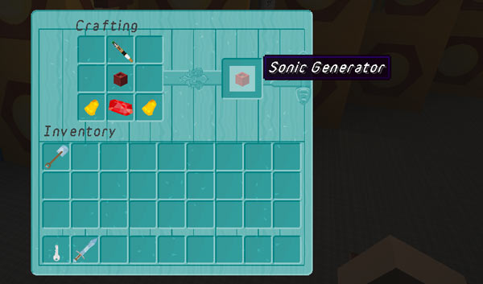

[Jump to video](#video)

# Sonic Generator

The Sonic Generator allows players to configure and produce a new screwdriver from the console. Each time a sonic is generated it costs a certain amount of Artron Energy.

You can craft a Sonic Generator (use `/tardisrecipe generator` to see the recipe), or place a flower pot and update it (`/tardis update generator`). If you place a flower pot, you will need to activate the generator the first time you use it. You do this by placing the craft ingredients into the GUI.

Right-clicking the generator opens the GUI where you can select the Sonic Screwdriver type and apply upgrades to it. The settings are saved when you generate a new sonic, so that in the future, SHIFT-right-clicking the generator will build a sonic with the last used settings without having to open the GUI.

### Costs

The Artron cost for building a sonic is based on a percentage of the `full_charge` amount (by default `5000`) in _artron.yml_, not the amount that a TARDIS actually has in its Artron Capacitor (which may be massively overcharged, 45549% perhaps).

The way it is calculated is: Standard sonic + upgrades

- The cost for the standard sonic is (by default) 10% of full charge
- The cost of each upgrade is also (by default) 10% of full charge
- The percentage can be adjusted by server admins in artron.yml in the sonic\_generator: config section

So if I had a sonic with the Emerald and Redstone upgrades it would cost by default:

`standard sonic + emerald upgrade + redstone upgrade` which is equal to  
`10% of full charge + 10% of full charge + 10% of full charge` which is equal to  
`500 + 500 + 500` which is equal to  
`1500`

The Sonic Generator GUI will show you the cost in the lower right hand corner :)

**Note:** Only upgrades the player has permission for will appear in the GUI, and the Admin Upgrade will never appear at all.

### Video
<iframe src="https://player.vimeo.com/video/169341113" width="600" height="365" frameborder="0" webkitallowfullscreen mozallowfullscreen allowfullscreen></iframe>

