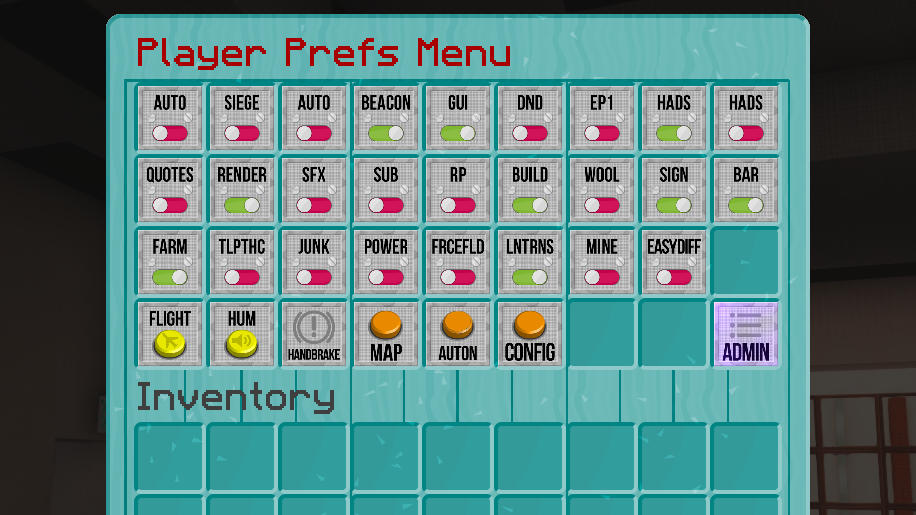

[Jump to video](#video)

# Sonic Screwdriver

You can craft an upgradable Sonic Screwdriver!

Type the command `/tardisrecipe sonic` in game to view the crafting recipe.

## The standard Sonic

The standard Sonic Screwdriver allows you to: open doors, press buttons and toggle
levers from a distance. If used while sneaking and right-clicking air, it will
open a GUI for setting Player Preferences. Permission for use: `tardis.sonic.standard`

## Upgrades

There are 9 upgrades that you can give your Sonic:

| Upgrade                     | Recipe                                      | Permissions                                        |
|-----------------------------|---------------------------------------------|----------------------------------------------------|
| Bio-scanner Circuit         | `/tardisrecipe bio-scanner-circuit`         | `tardis.sonic.bio` `tardis.sonic.freeze`        |
| Redstone Activator Circuit  | `/tardisrecipe redstone-activator-circuit`  | `tardis.sonic.redstone`                            |
| Emerald Environment Circuit | `/tardisrecipe emerald-environment-circuit` | `tardis.sonic.emerald` `tardis.sonic.plant`     |
| Diamond Disruptor Circuit   | `/tardisrecipe diamond-disruptor-circuit`   | `tardis.sonic.diamond` `tardis.sonic.silktouch` |
| Painter Circuit             | `/tardisrecipe painter-circuit`             | `tardis.sonic.paint` `tardis.sonic.paint_block`                           |
| Ignite Circuit              | `/tardisrecipe ignite-circuit`              | `tardis.sonic.ignite`                              |
| Pickup Arrows Circuit       | `/tardisrecipe pickup-arrows-circuit`       | `tardis.sonic.arrow`                               |
| Knockback Circuit           | `/tardisrecipe knockback-circuit`           | `tardis.sonic.knockback`                           |
| Brush Circuit               | `/tardisrecipe brush-circuit`               | `tardis.sonic.brush`                               |
| Server Admin Circuit        | `/tardisrecipe server-admin-circuit`        | `tardis.sonic.admin`                               |

To upgrade your Sonic Screwdriver, you combine it with a new circuit in a crafting table or smithing table (though
the smithing table requires an extra redstone template item). Each circuit has an associated permission, see the
[permissions page](permissions.html) for more details.

## Sonic abilities

### Player Pref Menu

Right-clicking AIR while sneaking with any sonic screwdriver opens the Player Pref Menu GUI
where you can click preference items to toggle them on and off. The preferences
menu also has a map button to open the [TARDIS Map](map.html) and the [Sonic Configurator](sonic-configurator.hml).

If a player also has the `tardis.admin` permission, they can swith to the Admin
Menu GUI.

### Sonic Sorter

The standard sonic screwdriver, when **LEFT**-clicked on a CHEST or TRAPPED\_CHEST,
can sort the container’s contents by order of the block type and damage value.
The permission for this is `tardis.sonic.sort`

### Bio-scanner

The Bio-scanner upgrade allows your Sonic to scan a player’s health, hunger and
time lived when you right-click them.

From a distance, the bio-scanner will freeze a player for 5 seconds. There is a
cooldown period (default 60 seconds) between uses, and players require the
permission `tardis.sonic.freeze`

### Redstone Activator

The Redstone Activator upgrade allows your Sonic to power on and off redstone wire,
lamps, pistons, detector rails and powered rails. You can also open iron doors by
right-clicking them.

### Emerald Environment

When right-clicking the ground with your Emerald Environment upgraded Sonic, it
will tell you the same information as the TARDIS Scanner, but relative to your
current location.

If players have the permission `tardis.sonic.plant`, using the Emerald Environment
Sonic Screwdriver to harvest food plants will automatically re-sow the plant if
the player has the appropriate seed item in their inventory.

### Diamond Disruptor

The Diamond Disruptor upgraded Sonic instantly breaks glass, stained glass, glass
panes, stained glass panes, iron fences, snow and web. If players have the
`tardis.sonic.silktouch` permission, the sonic will drop the block itself — for
example instead of receiving string from a web block, the drop will be web.

### Painter

The Painter upgraded Sonic allows you to change the colour of dyeable blocks
inside the TARDIS. These include WOOL, CARPET, STAINED CLAY, BEDS, CANDLES, CANDLE CAKES, STAINED GLASS and
STAINED GLASS PANES. To change the colour of these blocks you must have a suitable
dye item in the last (right-most) slot of you hotbar. LEFT-clicking a block while
sneaking (hold down the SHIFT key) will change the block colour and consume 1 dye item.

You can change Chamemelon preset coloured Police Boxes. Have a suitable
dye item in the last (right-most) slot of you hotbar, then RIGHT-click the item frame to set the colour.

If you have the permission `tardis.sonic.paint_blocks` you can tint any cubic shaped block in your TARDIS
in addtion to the coloured blocks listed above. Use the same method as for coloured blocks to add the tint -
to remove the tint, place a SPONGE block in the last (right-most) slot of your hotbar and LEFT-SHIFT-click 
the block.

### Ignite

The Ignite upgraded Sonic allows you to set fire to flammable blocks. It is not
very powerful, a flint and steel is probably more useful.

### Pickup Arrows

The Pickup Arrows upgraded Sonic allows you to set the pickup status of arrows.
Right-click the arrow, then step towards to pick it up.

### Knockback

The Knockback upgraded Sonic allows you to repel monsters when right-clicking them.

### Brush

The Brush upgraded Sonic allows you sonically brush suspicious blocks to get their hidden items.
Right-click the block until the item pops out. _Note:_ Due to the current limitations of the 
Bukkit API the item will not emerge slowly like it would with a vanilla brush.

### Server Admin

The Server Admin upgraded Sonic allows you to open the Admin menu GUI, scan a
TARDIS (owner, Artron Energy Level, last location and occupants) and remotely
open a player’s inventory (for viewing only).

### Video

<iframe src="https://player.vimeo.com/video/82537488" width="600" height="366" frameborder="0" webkitallowfullscreen mozallowfullscreen allowfullscreen></iframe>

&nbsp;

## Sonic Prefs Menu

You can change the texture of the sonic screwdriver to one of 15 different types.

To change the screwdriver texture:

- Open the Sonic Prefs menu using the command `/tardisprefs sonic`
- In the GUI, place your sonic in the lower left slot and then select the
  screwdriver of your choice
- To change the colour of the sonic’s display name, click the wool block to choose a colour
- Remove your screwdriver and close the GUI

## Default screwdriver
Server admins can set the default screwdriver type —
`/tardisconfig default_sonic [type]` — use tab completion to see a list of types.
