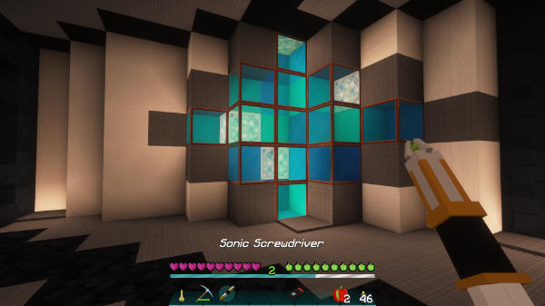

[Jump to video](#video)

# Sonic Screwdriver

You can craft an upgradable Sonic Screwdriver!

Type the command `/tardisrecipe sonic` in game to view the crafting recipe.

## The standard Sonic

The standard Sonic Screwdriver allows you to: open doors, press buttons and toggle levers from a distance. If used while sneaking and right-clicking air, it will open a GUI for setting Player Preferences. Permission for use: `tardis.sonic.standard`

## Upgrades

There are 6 upgrades that you can give your Sonic:

| Upgrade | Recipe | Permissions |
| --- | --- | --- |
| Bio-scanner Circuit | `/tardisrecipe bio-circuit` | `tardis.sonic.bio` `tardis.sonic.freeze` |
| Redstone Activator Circuit | `/tardisrecipe r-circuit` | `tardis.sonic.redstone` |
| Emerald Environment Circuit | `/tardisrecipe e-circuit` | `tardis.sonic.emerald` `tardis.sonic.plant` |
| Diamond Disruptor Circuit | `/tardisrecipe d-circuit` | `tardis.sonic.diamond` `tardis.sonic.silktouch` |
| Painter Circuit | `/tardisrecipe painter` | `tardis.sonic.paint` |
| Ignite Circuit | `/tardisrecipe ignite-circuit` | `tardis.sonic.ignite` |
| Pickup Arrows Circuit | `/tardisrecipe arrow-circuit` | `tardis.sonic.arrow` |
| Server Admin Circuit | `/tardisrecipe a-circuit` | `tardis.sonic.admin` |

To upgrade your Sonic Screwdriver, you combine it with a new circuit in the crafting table. Each circuit has an associated permission, see the [permissions page](permissions.html) for more details.

## Sonic abilities

### Player Pref Menu

Right-clicking AIR with any sonic screwdriver opens the Player Pref Menu GUI where you can click preference items to toggle them on and off. The preferences menu also has a map button to open the [TARDIS Map](map.html).

If a player also has the `tardis.admin` permission, they can swith to the Admin Menu GUI.

### Sonic Sorter

The standard sonic screwdriver, when **LEFT** -clicked on a CHEST or TRAPPED\_CHEST, can sort the container’s contents by order of the block type and damage value. The permission for this is `tardis.sonic.sort`

### Bio-scanner

The Bio-scanner upgrade allows your Sonic to scan a player’s health, hunger and time lived when you right-click them.

From a distance, the bio-scanner will freeze a player for 5 seconds. There is a cooldown period (default 60 seconds) between uses, and players require the permission `tardis.sonic.freeze`

### Redstone Activator

The Redstone Activator upgrade allows your Sonic to power on and off redstone wire, lamps, pistons, detector rails and powered rails. You can also open iron doors by right-clicking them.

### Emerald Environment

When right-clicking the ground with your Emerald Environment upgraded Sonic, it will tell you the same information as the TARDIS Scanner, but relative to your current location.

If players have the permission `tardis.sonic.plant`, using the Emerald Environment Sonic Screwdriver to harvest food plants will automatically re-sow the plant if the player has the appropriate seed item in their inventory.

### Diamond Disruptor

The Diamond Disruptor upgraded Sonic instantly breaks glass, stained glass, glass panes, stained glass panes, iron fences, snow and web. If players have the `tardis.sonic.silktouch` permission, the sonic will drop the block itself — for example instead of receiving string from a web block, the drop will be web.

### Painter

The Painter upgraded Sonic allows you to change the colour of dyeable blocks inside the TARDIS. These include WOOL, CARPET, STAINED CLAY, STAINED GLASS and STAINED GLASS PANES. To change the colour of these blocks you must have a suitable dye item in the last (right-most) slot of you hotbar. LEFT-clicking a block while sneaking (hold down the SHIFT key) will change the block colour and consume 1 dye item.

### Ignite

The Ignite upgraded Sonic allows you to set fire to flammable blocks. It is not very powerful, a flint and steel is probably more useful.

### Pickup Arrows

The Pickup Arrows upgraded Sonic allows you to set the pickup status of arrows. Right-click the arrow, then step towards to pick it up.

### Server Admin

The Server Admin upgraded Sonic allows you to open the Admin menu GUI, scan a TARDIS (owner, Artron Energy Level, last location and occupants) and remotely open a player’s inventory (for viewing only).

### Video
<iframe src="https://player.vimeo.com/video/82537488" width="600" height="366" frameborder="0" webkitallowfullscreen mozallowfullscreen allowfullscreen></iframe>

&nbsp;

## Sonic Prefs Menu

If you have the Custom Item Textures mod installed (part of [MCPatcher](optifine.html)) then you can change the texture of the sonic screwdriver to one of 15 different types.

To change the screwdriver texture:

- Open the Sonic Prefs menu using the command `/tardisprefs sonic`
- In the GUI, place your sonic in the lower left slot and then select the screwdriver of your choice
- Remove the screwdriver and close the GUI

Server admins can set the default screwdriver type — `/tardisadmin default_sonic [type]` — use tab completion to see a list of types.
