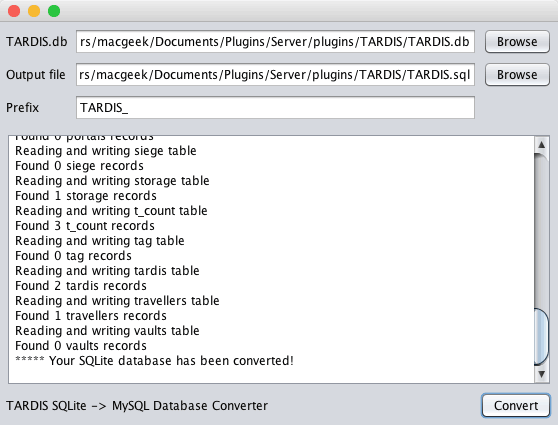

[Jump to video](#video)

# SQLite -\> MySQL conversion tool

You can easily change the database storage format of the TARDIS plugin using the SQLite -\> MySQL conversion tool.

Note: You can now achieve this by simply running `/tadmin convert_database`! You must configure your `config.yml` to the correct database credentials first, however.

To open the tool, double click the TARDIS.jar file. Follow the steps below to complete the conversion:

1. Click the first ‘Browse’ button to select your SQLite _TARDIS.db_ file
2. Click the second ‘Browse’ button to set the save location for the generated SQL file. Navigate to the appropriate directory and give the file a suitable name (such as _TARDIS.sql_)
3. If TARDIS data will be stored in a shared database, enter a prefix (such as _TARDIS\__) in the ‘Prefix’ field
4. Click the ‘Convert’ button
5. Open your MySQL database management tool (e.g. phpMyAdmin)
6. Import the TARDIS data using the generated SQL file
7. Add your MySQL connection credentials to the TARDIS plugin config.yml
8. If you added a table prefix in step 3, remember to add the prefix to the TARDIS plugin config.yml as well

## Uh-oh! `***** Error: SQLite JDBC driver not found!`

To fix this, you'll need to download the sqlite-jdbc jar from [this link](https://bitbucket.org/xerial/sqlite-jdbc/downloads/).

You might also need the MySQL connector from [here](https://dev.mysql.com/downloads/connector/j/). Make sure to get the version for your computer!

These need to go in your Extensions folder.

On Mac, this is found at `/Library/Java/Extensions/`, on Windows, it appears to be `C:\Program Files\Java\jdk1.8.0_201\jre\lib\ext`, although jdk1.8.0_201 may change depending on your Java version!

Move the JARs to this folder and retry! (Make sure to close and re-open the program!)

If you need help, please use the links on the top of the page to either join our support Discord server or create an issue on GitHub. We'll be happy to help!

## Uh-oh! `***** SQL Error: no such column x`

Make sure you're using the [latest build](http://tardisjenkins.duckdns.org:8080/job/TARDIS/lastSuccessfulBuild/). If it still breaks, create an issue on GitHub.

### Video
<iframe src="https://player.vimeo.com/video/139174559" width="600" height="366" frameborder="0" webkitallowfullscreen mozallowfullscreen allowfullscreen></iframe>
