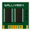
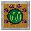

# TARDIS Circuits

A list of all the circuits used in the plugin.

## Console circuits

|                                       | Circuit         | Use                                                                                           |
|---------------------------------------|-----------------|-----------------------------------------------------------------------------------------------|
|  | ars             | Clicking the ‘Reconfigure’ button in the [ARS](ars.html) GUI                                  |
|  | chameleon       | Clicking the ‘Apply preset now’ button in the [Chameleon Circuit](chameleon-circuit.html) GUI |
|  | input           | Setting a destination with the [Destination Terminal](destination-terminal.html)              |
|  | invisibility    | Selecting the [Invibility](invisibility.html) preset in the Chameleon Circuit GUI             |
|  | materialisation | The TARDIS re-materialises after travelling                                                   |
|  | memory          | Processing a disk in the [Advanced Console](advanced-console.html)                            |
|  | randomiser      | Getting a [random](randomiser-circuit.html) destination in the Advanced Console               |
|  | scanner         | Pressing the [Scanner](scanner.html) button                                                   |
|  | telepathic      | Not really a circuit, but an actual device [Telepathic Circuit](telepathic-circuit.html)      |
|  | temporal        | Setting the time in the [Temporal Locator](temporal-locator.html) GUI                         |

## Sonic circuits

|                                             | Circuit     | Use                                                                                                            |
|---------------------------------------------|-------------|----------------------------------------------------------------------------------------------------------------|
|  | bio-scanner | Upgrade the sonic screwdriver with [Bio-scanner](sonic-screwdriver.html#bio-scanner) abilities                 |
|  | diamond     | Upgrade the sonic screwdriver with [Diamond Disruptor](sonic-screwdriver.html#diamond-disruptor) abilities     |
|  | emerald     | Upgrade the sonic screwdriver with [Emerald Environment](sonic-screwdriver.html#emerald-environment) abilities |
|  | redstone    | Upgrade the sonic screwdriver with [Redstone Activator](sonic-screwdriver.html#redstone-activator) abilities   |
|  | painter     | Upgrade the sonic screwdriver with [Painter](sonic-screwdriver.html#painter) abilities                         |
|  | ignite      | Upgrade the sonic screwdriver with [Ignite](sonic-screwdriver.html#ignite) abilities                           |
|  | knockback   | Upgrade the sonic screwdriver with [Knockback](sonic-screwdriver.html#knockback) abilities                     |
|  | brush       | Upgrade the sonic screwdriver with [Brush](sonic-screwdriver.html#brush) abilities                             |
|  | admin       | Upgrade the sonic screwdriver with [Server Admin](sonic-screwdriver.html#server-admin) abilities               |

## Other circuits

|                                             | Circuit          | Use                                                                                                                      |
|---------------------------------------------|------------------|--------------------------------------------------------------------------------------------------------------------------|
|        | perception       | An ingredient in crafting the [Perception Filter](perception-filter.html) (in hard mode), and Invisibilty Circuit        |
|  | sonic-oscillator | An ingredient in crafting the Sonic Screwdriver (in hard mode)                                                           |
|        | rift             | An ingredient in crafting the [Rift Manipulator](rift-manipulator.html)                                                  |
|        | locator          | An ingredient in crafting the [TARDIS Locator](tardis-items.html#tardis-locator) (in hard mode), and Stattenheim Circuit |
|        | stattenheim      | An ingredient in crafting the [Stattenheim Remote](tardis-items.html#stattenheim-remote) (in hard mode)                  |
