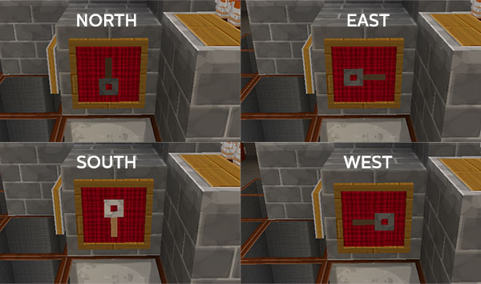

# TARDIS commands

### /tardis home

Set the TARDIS home location.

To set the TARDIS’s new home, look at the block you want to be the location, then type:

    /tardis home

### /tardis hide

Make the TARDIS police box disappear.

To hide the police box, type:

    /tardis hide

To show the police box again, type: `/tardis rebuild`

### /tardis setdest

Save potential TARDIS time travel locations where you might want the TARDIS Police Box to land. See also [/tardis save](#tardis-save)

To save a time travel location, look at the block you want the TARDIS to come to, and type:

    /tardis setdest [name]

### /tardis direction

Change the direction the TARDIS police box faces.

To change the direction, type:

    /tardis direction north
    /tardis direction west
    /tardis direction south
    /tardis direction east

You can also use the TARDIS **Direction Frame** to change the direction the exterior is facing:

- Place an Item Frame and run the `/tardis update direction` command on it
- Place a TRIPWIRE\_HOOK in the frame
- Right-click the Direction Frame to change the TARDIS direction
- SHIFT-right-click the Direction Frame to rebuild the TARDIS in the new direction

The tripwire hook in the Direction Frame is protected from stealing.

### /tardis find

If you have forgotten where you left the blue Police box, simply type:

    /tardis find

and you will be shown the co-ordinates where you left it. _Note:_ if the plugin difficulty is set to `hard` you will need to use the TARDIS Locator instead of this command.

### /tardis chameleon

You can toggle the Chameleon Circuit on or off, or short out the circuit with this command, type:

    /tardis chameleon on
    /tardis chameleon off
    /tardis chameleon short
    /tardis chameleon reset

For more information, visit the [Chameleon Circuit](chameleon-circuit.html) page

### /tardis comehere

Make the TARDIS come to you. _Note:_ if the plugin difficulty is set to `hard` you will need to use the TARDIS Stattenheim Remote instead of this command.

To remote control the TARDIS, look at the block you want the TARDIS to come to, then type:

    /tardis comehere

### /tardis save

Save TARDIS time travel locations — use this command to save the location where the TARDIS Police Box currently is. Using this command while holding a Save Storage Disk in you hand will write the save to the disk. _Note:_ if the plugin difficulty is set to `hard` you will need to craft Save Storage Disks instead of this command.

To save a time travel location, type:

    /tardis save [name]

Where `[name]` is a what you want to call the destination. Eg:

    /tardis save Ravine

### /tardis removesave

Delete saved time travel locations.

To delete a time travel location, type:

    /tardis removesave [name]

Where `[name]` is the destination to remove. Eg:

     /tardis removesave Lava_lake

### /tardis list

List saved time travel locations, companions, recharge points and TARDIS areas (such as airports).

Depending on which list you want to see, type:

    /tardis list saves
    /tardis list companions
    /tardis list areas
    /tardis list rechargers

### /tardis add

Add a player to your companions list and allow them to time travel with you (make sure they have the `tardis.enter` permission as well).

Type:

    /tardis add [player]

### /tardis remove

Remove a player from your companions list.

Type:

    /tardis remove [player]

### /tardis update

If you want to modify the interior of the TARDIS you will need to use this command. The TARDIS plugin needs to know the location of the IRON DOOR, STONE BUTTON, handbrake LEVER, the Artron Energy BUTTON, the Chameleon Circuit SIGN, and the 4 REPEATERS. First move the blocks to their new position then, type one of:

    /tardis update advanced
    /tardis update advanced
    /tardis update ars
    /tardis update artron
    /tardis update back
    /tardis update backdoor
    /tardis update beacon
    /tardis update button
    /tardis update chameleon
    /tardis update condenser
    /tardis update control
    /tardis update creeper
    /tardis update direction
    /tardis update dispenser
    /tardis update door
    /tardis update eps
    /tardis update farm
    /tardis update frame
    /tardis update generator
    /tardis update handbrake
    /tardis update igloo
    /tardis update info
    /tardis update keyboard
    /tardis update light
    /tardis update rail
    /tardis update save-sign
    /tardis update scanner
    /tardis update siege
    /tardis update stable
    /tardis update stall
    /tardis update storage
    /tardis update telepathic
    /tardis update temporal
    /tardis update terminal
    /tardis update toggle_wool
    /tardis update vault
    /tardis update village
    /tardis update world-repeater
    /tardis update x-repeater
    /tardis update y-repeater
    /tardis update z-repeater
    /tardis update zero

After executing the command, click on the block to update the TARDIS settings.

- `world-repeater` is the one closest to the door
- With your back to the door the `x-repeater` is the one on the right
- With your back to the door the `z-repeater` is the one on the left
- `y-repeater` is the one at the back

_If you have created a TARDIS with an older version of the plugin, you can also use this command to add any missing controls._

If you run the command `/tardis update` without any further arguments, an interactive clickable chat GUI will be displayed — just click the item in chat that you want to update, and avoid having to run the command multiple times (requires TARDIS v 3.1-beta-1 or higher).

### /tardis secondary

Similar to the `/tardis update` command, you can use the `/tardis secondary` command to update the locations of controls in secondary (and tertiary) consoles.

First move the blocks to their new position then, type one of:

    /tardis secondary artron
    /tardis secondary back
    /tardis secondary button
    /tardis secondary door
    /tardis secondary handbrake
    /tardis secondary world-repeater
    /tardis secondary x-repeater
    /tardis secondary y-repeater
    /tardis secondary z-repeater

After executing the command, click on the block to update the TARDIS settings.

### /tardis lamps

Another “update” type command, this one deletes all of a TARDIS’ lamp records from the database, and rescans the TARDIS console for lamps to add back in.

This is useful if you have changed the location of the lights of the console room and now I can’t turn them on or off.

**Note:** Make sure that you have set your lamp preference correctly before running the command (`/tardisprefs lanterns [on|off]`), so the plugin searches for the correct block type (Redstone Lamp or Sea Lantern).

    /tardisprefs lanterns [on|off]
    /tardis lamps

### /tardis rebuild

If your blue Police Box gets damaged (damn those creepers!), lost due to a server crash or you’ve hidden it, simply type:

    /tardis rebuild

and the Police Box will be recreated at its last known save position. Use `/tardis find` to locate it if you cannot remember where that was!

### /tardis rescue

Lets you rescue a player and materialise the TARDIS around them.

    /tardis resuce [player]

The player must accept the rescue attempt by typing `tardis rescue accept` in chat.

### /tardis namekey

Lets you rename the TARDIS key item to whatever you want. To rename it, simply type:

    /tardis namekey [your cool new name here]

This command is only available if you are running CraftBukkit `1.4.6` or later.

### /tardis exterminate

Type this command to confirm that you want to delete your TARDIS.

### /tardis gravity

Type this command to convert v2.0-beta-6 and earlier style gravity wells to the new updated style. You must be inside the TARDIS to run this command.

### /tardis occupy

Type this command if you have exited the TARDIS accidentally by another means than by the TARDIS door. It will toggle your TARDIS occupation status i.e. if you were inside the TARDIS it will set you to being _outside_.

### /tardis eject

Type this command, then click on the entity you want to eject from the TARDIS. The entity could be a player, villager, or mob (except horses — you need to ride those out). TARDIS admin users and server ops cannot be ejected.

### /tardis inside

List the players inside your TARDIS.

### /tardis room

Add a TARDIS room. _This command is outdated and should be avoided. Use the Architectural Reconfiguration System instead._

### /tardis jettison

Remove a TARDIS room. _This command is outdated and should be avoided. Use the Architectural Reconfiguration System instead._

### /tardis abort

Abort growing a TARDIS room. When a room starts growing the plugin will tell you the room task number, use this after the command to stop the room growing.

    /tardis abort [task number]

### /tardis version

Display the TARDIS plugin and CraftBukkit / Spigot / Paper version in chat.

### /tardis abandon

Abandon your TARDIS. See the [Abandon a TARDIS](https://eccentricdevotion.github.io/TARDIS/abandon.html) page.

### /tardis archive

Archive your TARDIS console. See the [Archiving TARDIS consoles](https://eccentricdevotion.github.io/TARDIS/archive.html) page.

### /tardis construct

Set the sign text or asymmetry of the TARDIS CONSTRUCT Chameleon preset.

    /tardis construct [line number|asymmetric] [text with optional colour code]

### /tardis arch\_time

Display the time that a player must remain Chameleon arched.

### /tardis arsremove

Remove the TARDIS' ARS records so that manual room growing can be used. **Not recommended**.

### /tardis colourise

Allows a player to change the colour of their TARDIS beacon glass with a Sonic Screwdriver.

### /tardis cube

Show a list of players who are carrying a Siege Cube.

### /tardis desktop

Open the TARDIS Desktop Theme GUI.

### /tardis excite

Initiate atmospheric excitation (make it snow) around your TARDIS.

### /tardis ep1

Make Emergency Program One appear.

### /tardis erase

Erase the TARDIS Storage Disk you have in your hand.

### /tardis make\_her\_blue

Makes the TARDIS visible again if it is using the INVISIBLE preset.

### /tardis save\_player

Save a Player to a blank TARDIS Storage Disk.

### /tardis section

Open the TARDIS Update chat GUI.

### /tardis tagtheood

Display the 'Tag the Ood' game statistics.

### /tardis transmat

Sets an internal TARDIS transmat location.

    /tardis transmat [name]
