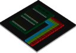
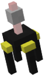

# TARDIS Items

| Item                                                             |                                                                                                                                                            | Description                                                                                                                                                                                                                                                                          | View recipe command            |
|------------------------------------------------------------------|------------------------------------------------------------------------------------------------------------------------------------------------------------|--------------------------------------------------------------------------------------------------------------------------------------------------------------------------------------------------------------------------------------------------------------------------------------|--------------------------------|
| [TARDIS key](player-preferences.html#player-preference-commands) |                      | Open, close, lock and unlock your TARDIS door.                                                                                                                                                                                                                                       | `/trecipe key`                 |
| [Sonic Screwdriver](sonic-screwdriver.html)                      |                                                                                                                             | The Doctor’s essential tool.                                                                                                                                                                                                                                                         | `/trecipe sonic-screwdriver`   |
| [Sonic Generator](sonic-generator.html)                          |                                                                                                         | Configure and produce a new screwdriver from the TARDIS console.                                                                                                                                                                                                                     | `/trecipe sonic-generator`     |
| [3-D Glasses](accessories.html#3-d-glasses)                      |                                                                                                                  | The tenth Doctor’s spectacular accessory.                                                                                                                                                                                                                                            | `/trecipe 3-d-glasses`         |
| [Acid Battery](rift-manipulator.html)                            |                                                                                                               | An ingredient in Rift Manipulators.                                                                                                                                                                                                                                                  | `/trecipe acid-battery`        |
| [Acid Bucket](planets.html#buckets)                              |                                                                                                                 | An ingredient in Acid Batteries. Only obtainable on the planet Skaro.                                                                                                                                                                                                                | Not craftable                  |
| [Artron Furnace](artron-furnace.html)                            |                                                                                                           | Faster smelting and cooking which can be powered by Artron Storage Cells.                                                                                                                                                                                                            | `/trecipe artron-furnace`      |
| [Artron Storage Cell](artron-cells.html)                         |                                                                                                      | A way of storing Artron Energy.                                                                                                                                                                                                                                                      | `/trecipe artron-storage-cell` |
| Biome Reader                            |                                                                                                               | Clicking the Biome Reader on a block will detect the biome at the player’s current location and automatically write a Biome Storage Disk to the Disk Storage Container if there is sufficient room and the biome disk is not there already. Cannot be used in the Nether or The End. | `/trecipe biome-reader`        |
| [Chameleon Arch](chameleon-arch.html) (Fob Watch)                |              | Change yourself from a Time Lord to a regular player.                                                                                                                                                                                                                                | `/trecipe fob-watch`           |
| [Handles](handles.html)                                          |                                                                                                                         | The Eleventh Doctor’s Cyberman head and companion.                                                                                                                                                                                                                                   | `/trecipe handles`             |
| [Monitor](monitor.html)                                          |                                                                                                                         | View the world outside of the TARDIS.                                                                                                                                                                                                                                                | `/trecipe monitor`             |
| [Monitor frame](monitor.html)                                    |                                                                                                             | Part of the TARDIS Monitor                                                                                                                                                                                                                                                           | `/trecipe monitor-frame`       |
| [Perception Filter](perception-filter.html)                      |  | Make yourself partially invisible.                                                                                                                                                                                                                                                   | `/trecipe perception-filter`   |
| [Remote Key](remote-key.html)                                    |                    | Lock and unlock the TARDIS remotely.                                                                                                                                                                                                                                                 | `/trecipe remote-key`          |
| [Rift Manipulator](rift-manipulator.html)                        |                                                                                                       | Set up personal TARDIS rechargers.                                                                                                                                                                                                                                                   | `/trecipe rift-manipulator`    |
| [Rust Bucket](planets.html#buckets)                              |                                                                                                                 | An ingredient in the Rust Plague Sword                                                                                                                                                                                                                                               | Not craftable                  |
| [Rust Plague Sword](planets.html#buckets)                        |                                                                                                     | Deals more damage to Daleks.                                                                                                                                                                                                                                                         | `/trecipe rust-plague-sword`   |
| [Schematic Wand](schematics.html)                                |                                                                                                           | Select the corners of TARDIS schematic areas.                                                                                                                                                                                                                                        | `/trecipe schematic-wand`      |
| [Paper Bag](food.html#paper-bag)                                 |                 | Store your Jelly Babies.                                                                                                                                                                                                                                                             | `/trecipe schematic-wand`      |
| [Custard Cream Dispenser](food.html#custard-cream)               |                                                                                         | Get your custard cream fix more easily from the TARDIS console.                                                                                                                                                                                                                      | `/trecipe schematic-wand`      |
| Stattenheim Remote                |                                                                                                   | Used to call the TARDIS to the block that you use the remote on.                                                                                                                                                                                                                     | `/trecipe stattenheim-remote`  |
| [TARDIS Communicator](handles.html#communicator)                 |                                                                                                                           | Communicate with Handles from outside of the TARDIS.                                                                                                                                                                                                                                 | `/trecipe coomunicator`        |
| TARDIS Locator                               |                                                                                                                  | Find the TARDIS by following a compass. This item replaces the `/tardis find` command when the plugin `difficulty` is set to hard.                                                                                                                                                   | `/trecipe locator`             |
| [Vortex Manipulator](vortex-manipulator.html)                    |                                                                                                          | Travel like Jack Harkness or River Song.                                                                                                                                                                                                                                             | `/trecipe vortex-manipulator`  |
| [Sonic Blaster](sonic-blaster.html)                              |                                                                                                                   | The squareness gun.                                                                                                                                                                                                                                                                  | `/trecipe sonic-blaster`       |

## Food

| Item          |                                                 | Description                                                | Recipe command           |
|---------------|-------------------------------------------------|------------------------------------------------------------|--------------------------|
| Jelly Babies  |        | The fourth Doctor’s favourite.                             | `/trecipe jelly-baby`    |
| Jammy Dodger  |    | A self-destruct button or just jummy?                      | `/trecipe jammy-dodger`  |
| Custard       |      | One half of the eleventh Doctor’s regeneration food.       | `/trecipe custard`       |
| Fish Finger   |      | The other half of the eleventh Doctor’s regeneration food. | `/trecipe fish-finger`   |
| Custard Cream |  | Eat one of the Thirteenth Doctor’s favourtites.            | `/trecipe custard-cream` |

## Disks

| Item      |                                            | Description                                                                                                | Recipe command                     |
|-----------|--------------------------------------------|------------------------------------------------------------------------------------------------------------|------------------------------------|
| area      |         | Area Storage Disk - automatically assigned whn server areas are made.                                      | Uncraftable                        |
| biome     |        | Biome Storage Disk - for storing biomes to travel to.                                                      | `/trecipe biome-storage-disk`      |
| blank     |        | Blank Storage Disk - the base disk, needed to craft all the others.                                        | `/trecipe blank-storage-disk`      |
| blueprint |  | Blueprint Disk - given by server admins, or bought from the TARDIS Shop, they to grant plugin permissions. | Uncraftable                        |
| control   |      | Authorised Control Disk - allow companions to travel to preset destinations in your TARDIS.                | `/trecipe authorised-control-disk` |
| handles   |      | Handles Program Disk - generated from the Handles Program GUI.                                             | Uncraftable                        |
| player    |       | Player Storage Disk - for storing players to travel to.                                                    | `/trecipe player-storage-disk`     |
| preset    |       | Preset Storage Disk - for setting the Chameleon preset when travelling.                                    | `/trecipe preset-storage-disk`     |
| save      |         | Save Storage Disk - for storing saved locations to travel to.                                              | `/trecipe save-storage-disk`       |

## [Time rotors](time-rotor.html)

| Item         |                                               | Description                           | Recipe command                 |
|--------------|-----------------------------------------------|---------------------------------------|--------------------------------|
| early        |              | Old Who style time rotor              | `/trecipe time-rotor-early`    |
| tenth        |          | Ninth and Tenth Doctors’ time rotor   | `/trecipe time-rotor-tenth`    |
| eleventh     |        | Eleventh Doctor’s time rotor          | `/trecipe time-rotor-eleventh` |
| twelfth      |          | Twelfth Doctor’s time rotor           | `/trecipe time-rotor-twelfth`  |
| delta        |              | Nether Delta console time rotor       | `/trecipe time-rotor-delta`    |
| engine       |            | Mechanical console time engine        | `/trecipe time-engine`         |
| engine rotor |  | Mechanical conole time rotor          | `/trecipe time-rotor-engine`   |
| hospital     |        | St John’s hospital console time rotor | `/trecipe time-rotor-hospital` |

## Custom blocks

| Block            |                                                                                                                                                          | Description                           | Recipe command            |
|------------------|----------------------------------------------------------------------------------------------------------------------------------------------------------|---------------------------------------|---------------------------|
| grow             |                                                                                                                             | TARDIS seed block animated processor. | `/trecipe grow`           |
| siege            |                         |                                       | `/trecipe siege-cube`     |
| the moment       |    |                                       | `/trecipe the-moment`     |
| hexagon          |                |                                       | `/trecipe hexagon`        |
| roundel          |                |                                       | `/trecipe roundel`        |
| offset roundel   |  |                                       | `/trecipe roundel_offset` |
| cog              |                        |                                       | `/trecipe hexagon`        |
| blue box         |              |                                       | `/trecipe hexagon`        |
| classic light    |             |                                       | `/trecipe hexagon`        |
| tenth light      |                 |                                       | `/trecipe hexagon`        |
| eleventh light   |            |                                       | `/trecipe hexagon`        |
| twelfth light    |             |                                       | `/trecipe hexagon`        |
| thirteenth light |          |                                       | `/trecipe hexagon`        |

