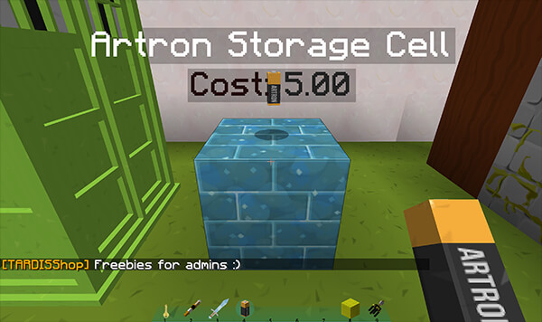

# TARDIS Shop

TARDIS Shop is a simple shop plugin for TARDIS items and blueprints. You can download it here:
[http://tardisjenkins.duckdns.org:8080/job/TARDISShop/](http://tardisjenkins.duckdns.org:8080/job/TARDISShop/).

Shops are **server** based, players _cannot_ setup their own personal shops.

### Requirements

In order for TARDISShop to function you will need to install:
* TARDIS & TARDISChunkGenerator
* [Vault](https://www.spigotmc.org/resources/vault.34315/)
* A permissions plugin

### Config options

| Option  | Type    | Default | Description |
| ------  | ------- | ------- | ----------- |
| `debug` | boolean | `false` | Whether to display debug messages in the server log |
| `block` | string  | `PRISMARINE_BRICKS` | The type of block that TARDIS items will be displayed on. This should be specified using the [Bukkit Material ENUM](https://hub.spigotmc.org/javadocs/spigot/org/bukkit/Material.html) name |
| `tardis_admin_free` | boolean | `true` | Whether players with `tardis.admin` permission get TARDIS items for free from the shop |

### Permissions

| Permission | Description | Default |
| ---------- | ----------- | ------- |
| `tardisshop.use` | Allow players to buy items from a TARDIS Shop | op |
| `tardisshop.admin` | Allow players to set up a TARDIS Shop | op |

## Setting up shop

A shop can be in any location and any size &mdash; you simply place a block anywhere you want to sell an item and then stock the item using a command.

### Setting item costs

The cost for a TARDIS item is stored in _items.yml_. You will need to edit this file and set prices based on however your current server economy is set up.

If you change the cost after adding a shop block, you can update the block with the new price by running the command:
```
/tardisshop update
```
This will reload the items configuration and update any blocks where the price is different than the config.

### Adding shop blocks

Adding new shop blocks is pretty simple:

1. Place the configured block (`PRISMARINE_BRICKS` by default) in the desired location
2. Run the command:
   ```
   /tardisshop add [item]
   ```
   You can use tab completion to see a list of available items
3. Follow the onscreen instructions and click the block &mdash; the item will appear with holographic labels for its name and cost
   
   
### Removing shop blocks

To remove a shop block:

1. Run the command:
   ```
   /tardisshop remove
   ```
2. Follow the onscreen instructions and click the block you want to remove
  
   
### Going shopping

To purchase items:

* Right-click a TARDIS Shop block
* If you have sufficient credit, you will be given the approprite item
