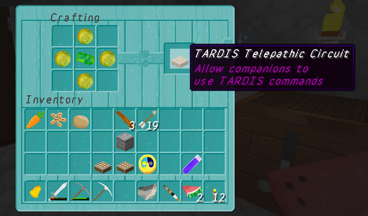

# TARDIS Telepathic Circuit

Players can craft a Telepathic Circuit for their TARDIS which will allow a companion to run any `/tardis`
or `/tardistravel` command for the TARDIS that they are in.

To view the crafting recipe use the command:

```
/tardisrecipe telepathic-circuit
```



## Player preferences

To turn the Telepathic Circuit on or off use the Sonic preferences GUI, or the command:

```
/tardisprefs telepathy [on|off]
```

- Requires the player to have the permission `tardis.prefs.telepathy`.

## Placing

To place or change the location of the Telepathic Circuit use the command:

```
/tardis update telepathic-circuit
```

## Use

Companions should right-click the telepathic circuit, then they can run `/tardis` or `/tardistravel` commands that will
affect the TARDIS they are in (rather than their own TARDIS if they have one).

- The Time Lord of the TARDIS must be online to use telepathic commands
- Companions can also rescue the Time Lord of a TARDIS using the Telepathic Circuit.


