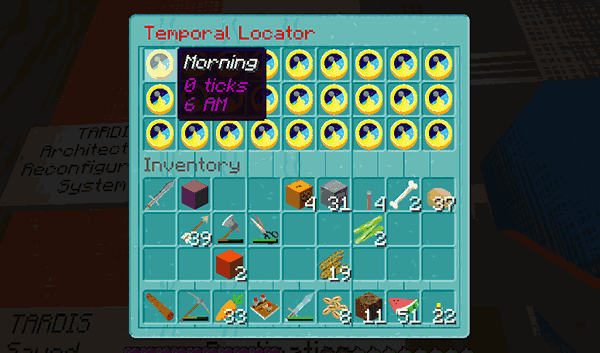
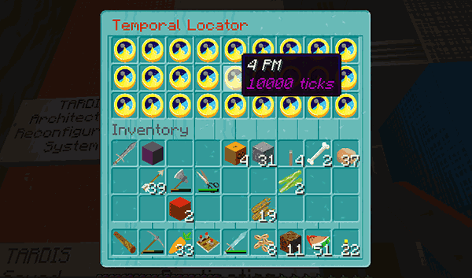

# Temporal Locator

The Temporal Locator lets players set their time relative to the server time. The Temporal Locator is accessible via the 
TARDIS Control Menu GUI, or you can place a sign and use the `/tardis update temporal` command.

In the Control Menu click the _Time_ button (or if using a separate Temporal Locator sign, right-click it)
to open the inventory based GUI. You will see a screen like the one below.

- Click a clock to set your time to the one displayed
- Time is set when exiting the TARDIS and reset back to server time when re-entering the TARDIS
- When players are temporally located, the perception filter is added to them
- Player time can be reset at any time by right-clicking air with a clock
- Players need `tardis.temporal` permission to use it

### Huh, what?

This doesn’t change the server time, that runs as normal, this just sets the player’s time on the client, e.g.:

- server time is 7000 ticks (morning)
- `eccentric_nz` has Temporal Location of 20000 ticks he will see the world at night
- `eccentric_nz` will NOT see zombie’s spawning because the server time is morning
- `thenosefairy` is standing next to `eccentric_nz` and is NOT temporally located
- `thenosefairy` will see the world in the same time as the server i.e. morning

