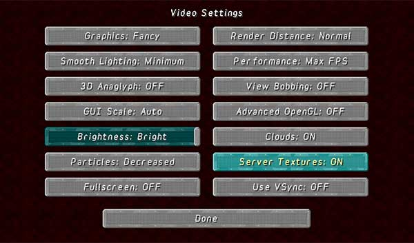

[Jump to video](#video)

# The Texture command

In order to use this feature, you must set **Server Textures: On** in the Minecraft client **Video Settings** options.

### Setting texture packs

You can set a texture pack for the TARDIS interior, and one for the regular world outside:

    /tardistexture in [url]
    /tardistexture out [url]

`[url]` must be a valid link to a texture pack file, e.g.: https://dl.dropboxusercontent.com/u/53758864/Minecraft\_Default.zip

To reset the outside texture pack back to the Minecraft default:

    /tardistexture out default

### Enabling and disabling

To turn resource pack switching on and off use the command:

    /tardistexture [on|off]

### Video
<iframe src="https://player.vimeo.com/video/66056277" width="600" height="366" frameborder="0" webkitallowfullscreen mozallowfullscreen allowfullscreen></iframe>