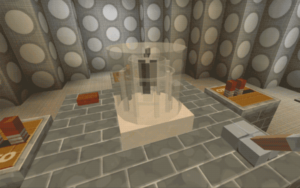
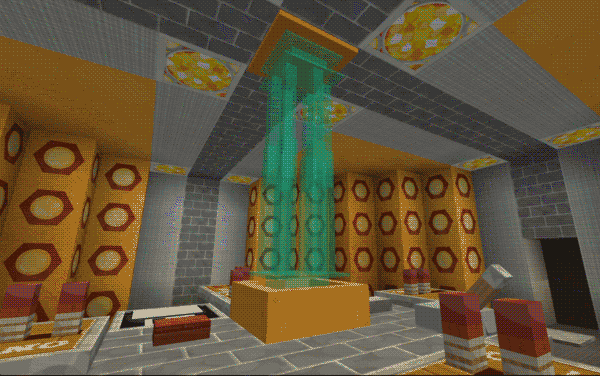
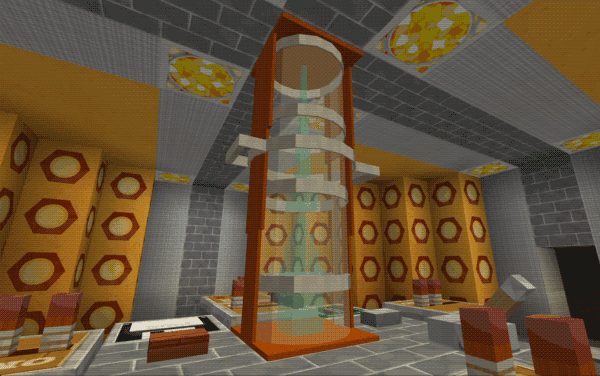
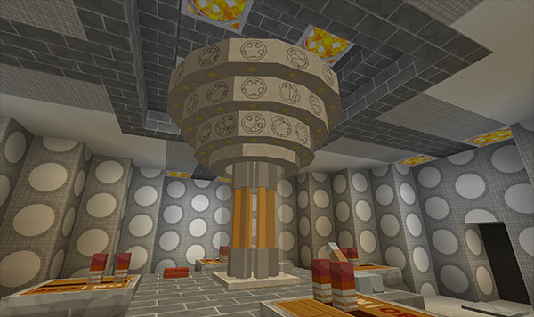
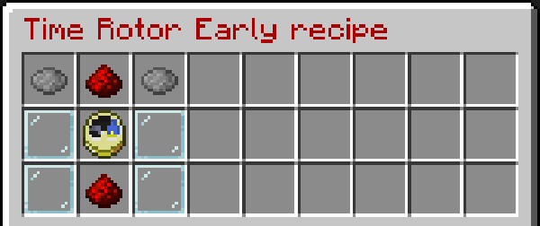

# Time Rotor

If you are using the [TARDIS-Resource-Pack](http://tardisjenkins.duckdns.org:8080/job/TARDIS-Resource-Pack/) you can add an animated time rotor to your console (or grow a ROTOR console from a TARDIS seed block).

There are 4 time rotor types.

Early era



Ninth / tenth era



Eleventh era



Twelfth era (not animated)



### Adding a Time Rotor

To add a time rotor to an existing console:

1. Craft a TARDIS TIme Rotor &mdash; see recipes below
2. Place an item frame in the desired location on the TARDIS console
3. Place the crafted time rotor into the item frame
4. Run the command:
   ```
   /tardis update rotor
   ```
5. Click the time rotor item frame

### Recipes

The crafting recipes for the four time rotors are:


```
DYE       | REDSTONE | DYE
GLASSPANE | CLOCK    | GLASSPANE
GLASSPANE | REDSTONE | GLASSPANE
```
Chage the dye colours for each rotor:
* 
* Early &mdash; Gray 
* Tenth &mdash; Cyan 
* Eleventh &mdash; Brown 
* Twelfth &mdash; Orange 

Use the command:
```
/tardisrecipe rotor_[early|tenth|eleventh|twelfth]
```
to see the recipes in game.
