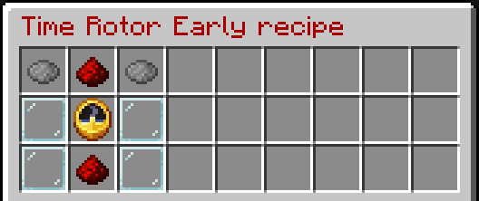

# Time Rotor

If you are using the [TARDIS-Resource-Pack](http://tardisjenkins.duckdns.org:8080/job/TARDIS-Resource-Pack/) you can add an animated time rotor to your console (or grow a ROTOR console from a TARDIS seed block).

There are 4 time rotor types.

Early era


Ninth / tenth era


Eleventh era


Twelfth era (not animated)


### Adding a Time Rotor

To add a time rotor to an existing console:

1. Craft a TARDIS Time Rotor &mdash; see recipes below
2. Place an item frame in the desired location on the TARDIS console
3. Place the crafted time rotor into the item frame
4. Run the command `/tardis update rotor`
5. Click the time rotor item frame

### To change a Time Rotor

Time rotors are locked (and the item frame made invisible) when you update them. In order to make changes to the time 
rotor you need to unlock it.

1. Run the command `/tardis update rotor unlock`
2. Make changes to the item frame and rotor
3. Re-update the rotor with the command `/tardis update rotor`

### Recipes

The crafting recipes for the four time rotors are:


```
DYE       | REDSTONE | DYE
GLASSPANE | CLOCK    | GLASSPANE
GLASSPANE | REDSTONE | GLASSPANE
```
Change the dye colours for each rotor:

* Early &mdash; Gray 
* Tenth &mdash; Cyan 
* Eleventh &mdash; Brown 
* Twelfth &mdash; Orange 

Use the command:
```
/tardisrecipe time-rotor-[early|tenth|eleventh|twelfth]
```
to see the recipes in game.
