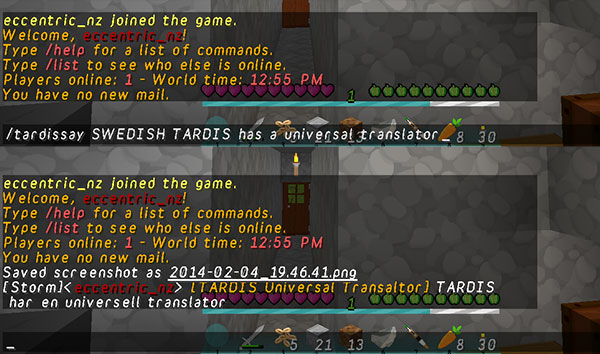

# TARDIS Universal Translator

The translation circuit is a part of the TARDIS that allows instantaneous translation of most languages spoken or written in the universe.

You can send translated text in chat using the `/tardissay [language] [message]`, for example:

    /tardissay SWEDISH hello world

## How it works

The command uses the free Bing translation API to translate your message — see the list of supported languages below.

- `[language]` — You need to specify the language you want to translate into
- `[message]` — The plugin tries to auto-detect the language that you are typing in, however you can force the language it uses by setting a player preference:

    /tardisprefs language [language]

### Supported languages

    AUTO_DETECT
    ARABIC
    BULGARIAN
    CATALAN
    CHINESE_SIMPLIFIED
    CHINESE_TRADITIONAL
    CZECH
    DANISH
    DUTCH
    ENGLISH
    ESTONIAN
    FINNISH
    FRENCH
    GERMAN
    GREEK
    HAITIAN_CREOLE
    HEBREW
    HINDI
    HMONG_DAW
    HUNGARIAN
    INDONESIAN
    ITALIAN
    JAPANESE
    KOREAN
    LATVIAN,
    LITHUANIAN
    MALAY
    NORWEGIAN
    PERSIAN
    POLISH
    PORTUGUESE
    ROMANIAN
    RUSSIAN
    SLOVAK
    SLOVENIAN
    SPANISH
    SWEDISH
    THAI
    TURKISH
    UKRAINIAN
    URDU
    VIETNAMESE

