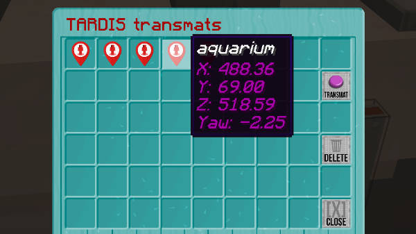
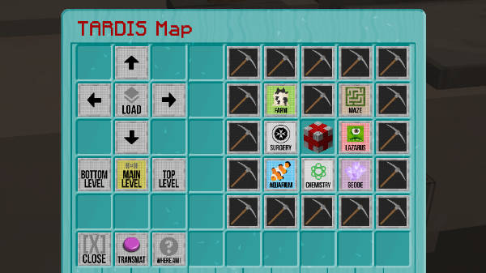
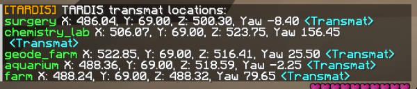

[Jump to video](#video)

# TARDIS Transmat

Transmat is a common technological form of instantaneous transport.
It was designed for matter transference, and is a subset of methodologies described as teleportation.

You can use the TARDIS Transmat feature to move quickly throughout your TARDIS.

### Adding transmat loactions

To add transmat locations, stand at the location where you want to add a transmat location, then run the command:

    /tardis transmat add [name]

### Transmatting to saved locations

You can transmat to a location in several ways:

- Use the transmat _command_

  `/tardis transmat tp [name]`

- Use the _Transmat GUI_ found in the TARDIS Control Centre (this is the best option for Bedrock players).
   - Click on a saved transmat location
   - Click the Transmat button to teleport

- Use the _TARDIS Map GUI_ (found in the TARDIS Control Centre or Sonic Preferences GUI)
   - Load the map
   - Click on the room or console you want to teleport to
   - Click the Transmat button

- Use the transmat _command_ to open a list of clickable chat entries
    - Run the command `/tardis transmat list`
    - Reopen the chat window and click on a transmat link

### Modifying transmat locations

You can update or remove a transmat location with the `tardis transmat` command:

- To update a saved location, move to the new desired location, then run the command:

    `/tardis transmat update [name]`
    
- To remove a saved transmat location, run the command:

    `/tardis transmat remove [name]`

### Binding transmats

You can use the `/tardisbind add transmat [name]` command to bind a transmat to a physical object (such bas a button).
See [Bind commands](bind-commands.html) for more detail.

### Video

<iframe width="600" height="366" src="https://www.youtube.com/embed/lvkOCDjkcOc?rel=0" frameborder="0" allowfullscreen></iframe>
