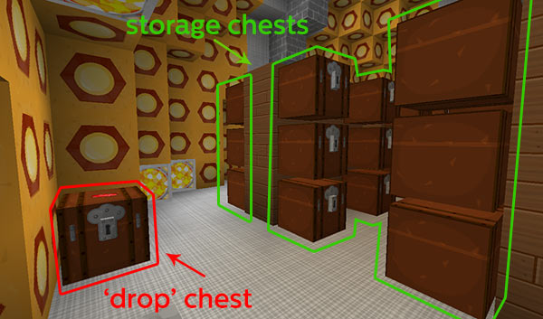

# Vault room

As of TARDIS v3.1-beta-1 the Vault room will automatically sort items into the chests contained within it.

When the room is grown (or updated with the `/tardis update vault` command) a ‘drop’ chest is added to the room (by default a TRAPPED\_CHEST). Blocks/items placed in the drop chest will automatically be sent to the chest with the same block/item in it when you close the chest.

To enable sorting:

- place at least one block/item into a storage chest
- open the ‘drop’ chest and place the items you want to sort into it
- close the ‘drop’ chest
- the blocks/items are moved to the chest with the same block/item in it

