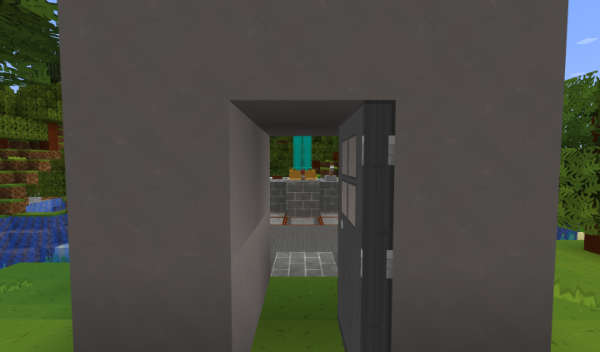

# View Interior

As of TARDIS v4.11.0 you can view the interior of the TARDIS through the open Chameleon preset door). This feature is
currently a work in progress.

The Chameleon preset must be one with an _actual door block_, not a trapdoor or one of the coloured item frame Police
Boxes.

To enable/disable the viewing of interiors:

- use the command `/tardisconfig view_interior [true|false]`

When you open your exterior TARDIS door, you will see the interior features of your TARDIS.
