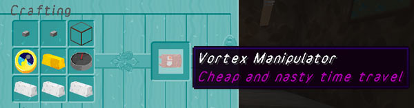

[Jump to videos](#videos)

# Vortex Manipulator

> "Vortex manipulator. Cheap and nasty time travel. Very bad for you. I'm trying to give it up."

TARDISVortexManipulator is a complementary add-on plugin that brings the [Vortex Manipulator](https://tardis.fandom.com/wiki/Vortex_manipulator) to Minecraft. Travel like Jack Harkness or River Song from Doctor Who! Have the Vortex Manipulator in your hand, put in your desired location, and GO!

You can download the TARDISVortexManipulator JAR from here: [http://tardisjenkins.duckdns.org:8080/job/TARDISVortexManipulator/](http://tardisjenkins.duckdns.org:8080/job/TARDISVortexManipulator/)

The TARDISVortexManipulator models and textures are part of the [TARDIS-Resource-Pack](http://tardisjenkins.duckdns.org:8080/job/TARDIS-Resource-Pack/)

## Requirements

The plugin utilises the TARDIS plugin API, so you must have TARDIS installed as well.

For the full experience, you'll need the [TARDIS-Resource-Pack](http://tardisjenkins.duckdns.org:8080/job/TARDIS-Resource-Pack/)

## Crafting
Crafting is a little complicated, as it's an advanced piece of technology. Requirements for crafting are (left to right, top row first): stone button, another stone button, glass; clock, gold, compass; iron ingot, iron ingot, iron ingot. Custom graphics for the crafted item and GUI are available as part of the [TARDIS-Resource-Pack](http://tardisjenkins.duckdns.org:8080/job/TARDIS-Resource-Pack/).




## Multi-world support

The plugin works with Multiverse (or other multi-word plugin), remembering personally saved locations and allowing for direct teleporting to any available world and coordinate. Also having respect for World Borders (plugin and the 1.8 default if possible). Towny/Faction/WorldGuard/GriefPrevention suport can be enabled via the config.


## Commands

| Command | Description                                                                 |
|---------|-----------------------------------------------------------------------------|
| __Help__ |
| `/vmh {subject}` or `/vm help` | This will display help and commands for the plugin
| __Travel__ |
| `/vm {worldname}` | Teleport to a random location in the specified world |
| `/vm {worldname} {X} {Y} {Z}` | Teleport to specific location in the specified world |
| `/vm` | Teleport to random world, random location. If another player is standing on the same block as you, they will teleport with you, using more energy |
| `/vm go {custom}` | Teleport to saved location |
| __Saves__ |
| `/vms {custom}` | Save a specific location |
| `/vmr {custom}` | Remove saved location |
| __Messaging__ |
| `/vmm {player} {message}` | Send message to other user with a device |
| `/vmm {in/out} [page]` | See received or sent messages |
| `/vmm read {#}` | Read specific message |
| `/vmm delete {#}` | Delete specific message |
| `/vmm {in/out} clear` | Clearing "new" sends to old, and clearing "old" deletes all stored messages |
| __Lifesigns__ |
| `/vml` | list entities nearby, mobs and players |
| `/vml {player}` | Gets health and hunger of a player, possibly oxygen level too. |
| __Beacon__ |
| `/vmb` | send out a beacon signal that lasts until the player moves |

## Permissions

* `vm.teleport` - allow crafting and using of a Vortex Manipulator
* `vm.message` - for messaging system
* `vm.lifesigns` - detect lifesigns and info on players
* `vm.beacon` - activate the beacon feature

## Configuration

The default config is shown below:

```yaml
allow:
    teleport: true
    messaging: true
    lifesigns: true
    beacon: true
    multiple: true
    look_at_block: true
recipe:
    shape: BBG,WOC,III
    ingredients:
        B: STONE_BUTTON
        G: GLASS
        W: WATCH
        O: GOLD_INGOT
        C: COMPASS
        I: IRON_INGOT
    result: WATCH
    amount: 1
    lore: "Cheap and nasty time travel"
tachyon_use:
    max: 1000
    recharge: 25
    recharge_interval: 600
    travel:
        random: 100
        world: 150
        coords: 200
        saved: 50
    lifesigns: 15
    beacon: 1000
    message: 5
storage:
    database: sqlite
    mysql:
        url: mysql://localhost:3306/TARDIS
        user: bukkit
        password: mysecurepassword
date_format: dd/MM/YY HH:mm
lifesign_scan_distance: 16
max_look_at_distance: 50
block_travel_malfunction_chance: 0
respect:
    worldborder: true
    worldguard: true
    griefprevention: true
    factions: true
    towny: true
debug: false
```

### Video

<iframe width="600" height="366" src="https://www.youtube.com/embed/broKxj7z3cI?rel=0" frameborder="0" allowfullscreen></iframe>

<iframe width="600" height="366" src="https://www.youtube.com/embed/mYq9hOWmVS8?rel=0" frameborder="0" allowfullscreen></iframe>
