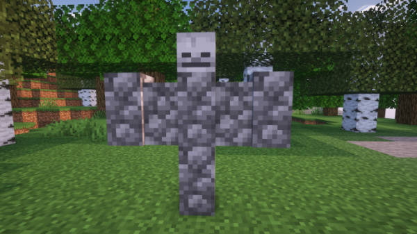
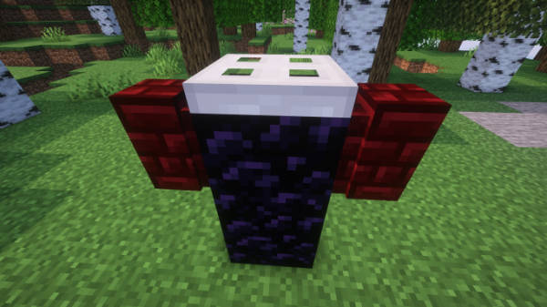
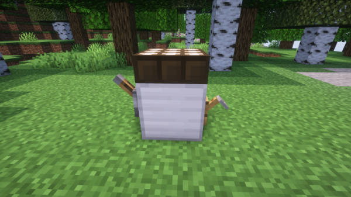
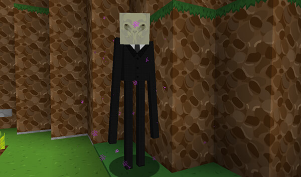

[Jump to video](#video)

# Weeping Angels

TARDISWeepingAngels is a TARDIS plugin module that transforms Minecraft mobs into terrifying
Whovian [monsters](https://www.bbc.co.uk/programmes/articles/4tDN85fyxYXTtVPrCql8jB/monsters).

> __Note__ For TARDIS version 4.13.0 and below you can download the separate TARDISWeepingAngels plugin JAR from
> here: [TARDISWeepingAngels](http://tardisjenkins.duckdns.org:8080/job/TARDISWeepingAngels/)<br>
The instructions below are for the TARDIS module, but are pretty much the same, with some extra configuration options 
(database / plugin respect), and separate commands instead of sub-commands._

## Enabling the module

To use the Weeping Angels module, it must be enabled in the TARDIS config.

- Type `/tardisconfig weeping_angels [true|false]` to enable or disable the feature.
- A server restart is required when changing the config value.

The TARDISWeepingAngel models and textures are part of
the [TARDIS-Resource-Pack](http://tardisjenkins.duckdns.org:8080/job/TARDIS-Resource-Pack/)

## Requirements

**Version 4.x.x of this plugin/module requires Paper server or a compatible fork.**

Version 5 and higher will run on SPigot and Paper servers :)

For the full experience (textures and sounds), you’ll need
the [TARDIS-Resource-Pack](http://tardisjenkins.duckdns.org:8080/job/TARDIS-Resource-Pack/)

## Monsters

* [Weeping Angels](#weeping-angels-1)
* [Cybermen](#cybermen)
* [Daleks](#daleks)
* [Empty Children](#empty-children)
* [Hath](#hath)
* [Headless Monks](#headless-monk)
* [Ice Warriors](#ice-warriors)
* [Judoon](#judoon)
* [K-9](#k-9)
* [Mire](#mire)
* [Ood](#ood)
* [Racnoss](#racnoss)
* [Sea Devils](#sea-devils)
* [Silent]()
* [Silurians](#silurians)
* [Slitheen](#slitheen)
* [Sontarans](#sontarans)
* [Strax](#strax)
* [Toclafane](#toclafane)
* [Vashta Nerada](#vashta-nerada)
* [Zygons](#zygons)

## Features

#### For each monster:

- Configurable spawn rate
- Configurable drop on death
- Only spawn them in the worlds you want

## Information

### Weeping Angels

Weeping Angels only spawn at night in loaded chunks. They may also spawn when metioned in chat (if configured) or by
building them with blocks.

To build an angel, place four cobblestone walls in a ‘T’ shape, then place a skeleton skull on the top. If the builder
has the permission `tardisweepingangels.build.angel` an angel will spawn.



Weeping Angels can only be killed with the configured weapon - by default a DIAMOND_PICKAXE - hitting them with anything
else has no effect. When they die they drop a random (1-3) amount of STONE.

The angels move pretty fast, but you can freeze them in place by looking at them and quickly pressing the sneak key.
Better arm yourself or flee quickly though, as they’ll be after you again in a snap - and if they touch you, you’ll be
teleported away to a random location. If the TARDIS plugin is also installed, your TARDIS Key will be stolen.


Random teleport locations can be specified by world, or you can set specific locations to teleport players to.

* Random teleports are set in the `angels.teleport_worlds` section in _monsters.yml_.
  Add all the worlds you want to allow teleports to. A random location will be generated from loaded chunks in a
  randomly selected world.
* Specific teleport locations require `angels.teleport_to_location` to be set to `true`. You can then use
  the `/twa teleport [replace|true|false]` command.
    * You can list multiple locations to teleport to in the `angels.teleport_locations` section in _monsters.yml_.
    * By default, one location exists - the spawn location of the server’s main world.
    * To add a location, stand in the place you want to add and use the `/twa teleport` command.
    * To replace all previously stored locations, repeat the above step, but use the `/twa teleport replace` command.
    * To toggle between random world and specific location teleporting use the command `/twa teleport [true|false]` -
      where `true` is for specific locations.

### Cybermen

Cybermen can spawn at anytime. If configured, Cybermen will upgrade villagers and players when they have killed them (a
new Cyberman) spawns in their place. If the upgraded entity was a player, the new Cyberman displays the player’s name
above its head.


### Ice Warriors

Ice Warriors are really angry. They can spawn at anytime, but only spawn in snowy, icy or cold biomes. They carry an ice
dagger. Did I mention they’re angry!


### Daleks

Daleks come in different colours, but mostly spawn in their typical bronze colour. Exterminate!
When a Dalek spawns there is a configurable chance that either Dalek Sec or Davros will spawn instead.


### Dalek Sec

Dalek Sec just looks fabulous! He’s passive unless you annoy him.


### Davros

Davros doesn’t do much yet, but probably best not to get in his way.


### Empty Children

Empty Children spawn anytime, and are of course child size. If you are killed by an Empty Child you get a gas mask
applied to your head when you respawn that you can’t remove for 30 seconds.


### Hath

Hath don’t do much yet, but they look pretty cool.


### Headless Monk

Headless Monks fire energy blasts from their hands as well as channelling that energy into their swords.


### Judoon

Judoon are the police force of the Whoniverse. Left-click a Judoon to claim it as your own. You can equip Judoon with
ammunition (craft with arrows and gunpowder and put into a shulker box, then **left**-click the Judoon with the box).
Judoon can then be toggled to be in guard mode (left-click them with out a shulker box in hand) and will shoot any hostile 
mobs nearby. Use the `/twa follow` command or **right**-click the Judoon to make the Judoon follow you around.

Judoon can be built by players if they have the permission `tardisweepingangels.build.judoon` - place two obsidian
blocks one on top of the other. Place red nether brick walls on either side to form a ‘T’, then place an iron trapdoor
on the top.




### K-9

You can either craft a K-9 or tame a wolf to get a K-9! Clicking a K-9 will toggle whether he will follow you or stay
put. The crafting recipe is 3 iron ingots, 3 redstone, and 3 bones in the crafting grid:

```
III
RRR
BBB
```


You can also build K-9 with blocks if you have the permission `tardisweepingangels.build.k9`. Place an iron block, with
a lever and a tripwire hook on each side, finish with a dayight detector on top.



### Mire

The Mire will distill you down to your essential nectar.


### Ood

Ood spawn randomly around villagers. Left-click an Ood to claim it as your own. Use the `/twa follow` command or 
**right**-click the Ood to make the Ood follow you around. **Left**-click a claimed Ood to change the Ood’s eye to red.


### Racnoss

Racnoss spawn randomly in the Nether.


### Sea Devils

Found in the sea and on land, best if they don’t find you!


### Silent

Silent spawn anywhere. Beware their deadly energy discharges!



### Silurians

Only spawn underground in caves. Watch out for their Silurian guns!


### Slitheen

A nasty flatulent surprise, best avoided if you want to survive.


### Sontarans

Sontarans will try to kill you (as any good Sontaran should). If you manage to right-click a Sontaran with a Weakness
Potion before he kills you, he will transform into Strax.


### Strax

If you right-click Strax he’ll talk to you, and if you right-click him with an empty bucket, you’ll be able to milk him.
Yum, yum Sontaran lactic fluid :) Be careful not to anger him though as he’ll go rabid on you and let his killer
Sontaran instincts get the better of him!


### Toclafane

Toclafane fly around passively until you hit them, then watch out as they get angry with you. They explode when they
die.


### Vashta Nerada

Vashta Nerada have a random (configurable) chance of spawning when a bookshelf is broken, say “Hey who turned out the
lights?” and of course try to eat you!


### Zygons

Zygons don’t do much yet (except try to kill you), but they look pretty cool.


## Monsters configuration

For configuration options, see the [Monsters configuration](configuration-monsters.html) page.

## Commands

| Command | Arguments                             | Description                                                                 |
|---------|---------------------------------------|-----------------------------------------------------------------------------|
| `/twa`  | `spawn [monster type]`                | Spawn a monster on the block you are looking at                             |  
|         | `disguise [monster type] [on:off]`    | Disguise yourself as a TWA monster                                          |
|         | `equip [monster type]`                | Equip an armor stand with a TWA monster                                     |
|         | `count [monster type] [world]`        | Reports the current number of monsters in the specified world               |
|         | `kill [monster type] [world]`         | Kills all of the monsters in the specified world                            |
|         | `set [monster type] [world] [amount]` | Sets the maximum number of the monsters that are allowed to spawn the world |
|         | `follow`                              | Makes the Ood/Judoon/K9 you are targeting follow you                        |
|         | `stay`                                | Makes the Ood/Judoon/K9 you are targeting _stop_ following you              |
|         | `remove`                              | Removes the Ood/Judoon/K9 you are targeting                                 |
|         | `give [player] [monster type]`        | Gives a player a monster head to display in an item frame                   |
|         | `teleport [replace\|true\|false]`     | Toggle and add specific angel teleport locations                            |

### Video

<iframe width="600" height="366" src="https://www.youtube.com/embed/Ybpo4KQZpF4?rel=0" frameborder="0" allowfullscreen></iframe>
