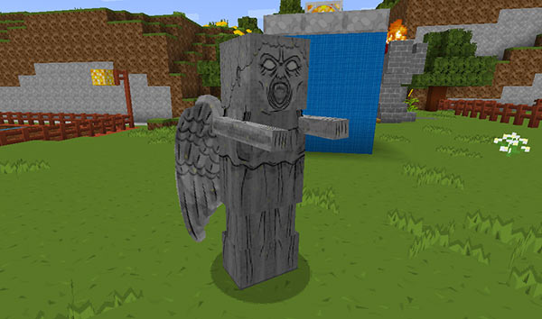
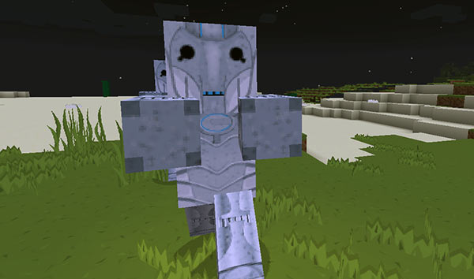
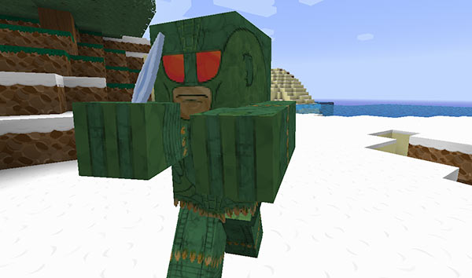

[Jump to video](#video)

# Weeping Angels

TARDISWeepingAngels is a complementary add-on plugin that transforms skeletons into terrifying Weeping Angels, zombies into Cybermen and Pig Zombies into angry Ice Warriors.

You can download the TARDISWeepingAngels JAR available from the Bukkit page: [http://dev.bukkit.org/bukkit-plugins/tardisweepingangels/](http://dev.bukkit.org/bukkit-plugins/tardisweepingangels/)

And the TARDISWeepingAngels Resource Pack from the CurseForge page: [http://minecraft.curseforge.com/texture-packs/tardisweeping-angels/](http://minecraft.curseforge.com/texture-packs/tardisweeping-angels/)

## Features

- Weeping Angels, Cybermen and Ice Warriors!

#### For each monster:

- Configurable spawn rate
- Configurable drop on death
- Only spawn them in the worlds you want

#### Angels:

- Configurable killing item
- Can be frozen in place for a configurable time
- Configurable TARDIS Key stealing

#### Cybermen:

- Can upgrade villagers and players

## Weeping Angel Information

Weeping Angels only spawn at night in loaded chunks. They spawn with grey leather armour and a water lily helmet (their wings).

Weeping Angels can only be killed with the configured weapon — by default a DIAMOND\_PICKAXE — hitting them with anything else has no effect. When they die they drop random amounts (1-3) of the configured items (STONE and COBBLESTONE by default), and very rarely a skull.

The angels move pretty fast, but you can freeze them in place by looking at them and quickly pressing the sneak key. Better arm yourself or flee quickly though, as they’ll be after you again in a snap — and if they touch you, you’ll be teleported away to a random location. If configured, your TARDIS Key will also be stolen.

## Cybermen Information

Cybermen can spawn at anytime. They spawn with iron armour.

If configured, Cybermen will upgrade villagers and players when they have killed them (a new Cyberman) spawns in their place. If the upgraded entity was a player, the new Cyberman displays the player’s name above its head.

## Ice Warrior Information

Ice Warriors are really angry. They can spawn at anytime, but only spawn in snowy, icy or cold biomes. They carry an ice dagger. Did I mention they’re angry!

## Commands

| Command | Arguments | What it does | Aliases |
| --- | --- | --- | --- |
| `/angel` | None | Spawn an angel on the block you are looking at | `/tardisangel` `/tangel` |
| `/cyberman` | None | Spawn an angel on the block you are looking at | `/tcyberman` `/tardiscyberman` `/cyber` |
| `/warrior` | None | Spawn an Ice Warrior on the block you are looking at | `/twarrior` `/tardiswarrior` `/ice` |
| `/angeldisguise` | `[on:off]` | Disguises you as a Weeping Angel | `/tardisangeldisguise` `/angeld` |
| `/icedisguise` | `[on:off]` | Disguises you as an Ice Warrior | `/warriordisguise` `/iced` |
| `/cyberdisguise` | `[on:off]` | Disguises you as a Cyberman | `/cyberd` `/cybermandisguise` `/cybermand` |
| `/angelcount` | `[a:c:i] [world]` | Reports the current number of the specified monster [a:c:i] in the specified world [world] | `/cybercount` `/icecount` `/acount` `/ccount` `/icount` |
| `/twa` | `[a:c:i] [add:remove] [world]` | Add or remove [add:remove] a world [world] to/from the worlds list for the specified monster [a:c:i] | `/aadmin` `/angeladmin` `/tardisweepingangels` |

## Configuration

The default config is shown below:

    angels:
        spawn_rate:
            how_many: 5
            how_often: 400
            max_per_world: 50
        worlds:
            - world
        freeze_time: 100
        weapon: DIAMOND_PICKAXE
        drops:
            - COBBLESTONE
            - STONE
        angels_can_steal: true
    ice_warriors:
        spawn_rate:
            how_many: 3
            how_often: 400
            max_per_world: 25
        worlds:
            - world
        drops:
            - ICE
            - PACKED_ICE
            - SNOW_BLOCK
    cybermen:
        spawn_rate:
            how_many: 3
            how_often: 400
            max_per_world: 30
        worlds:
            - world
        drops:
            - REDSTONE
            - STONE_BUTTON
        can_upgrade: true

The `spawn_rate` section sets Angel, Cybermen and Ice Warrior spawning options

- `how_many` sets how many monsters to spawn each time.
- `how_often` is the time period (in server ticks — _20 ticks = 1 second_) between spawn attempts.
- `max_per_world` is the maximum number of monsters can be alive at one time.

The `worlds` section allows you to list the worlds you want the monsters to spawn in.

`drops` sets a list of items that drop when the monsters is killed.

#### Angel specific

`freeze_time` is the length of time (in server ticks) that the Angels remain motionless for.

`weapon` sets the item that will kill a Weeping Angel.

`angels_can_steal` sets whether the Angels can steal your TARDIS Key — requires the TARDIS plugin to be installed.

#### Cybermen specific

`can_upgrade` sets whether the Cybermen can upgrade players and villagers.

### Video
<iframe width="600" height="366" src="https://www.youtube.com/embed/Ybpo4KQZpF4?rel=0" frameborder="0" allowfullscreen></iframe>
