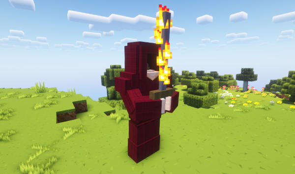
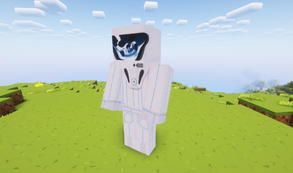

[Jump to video](#video)

# Weeping Angels

TARDISWeepingAngels is a complementary add-on plugin that transforms Minecraft mobs into terrifying Whovian [monsters](https://www.bbc.co.uk/programmes/articles/4tDN85fyxYXTtVPrCql8jB/monsters).

You can download the TARDISWeepingAngels JAR from here: [http://tardisjenkins.duckdns.org:8080/job/TARDISWeepingAngels/](http://tardisjenkins.duckdns.org:8080/job/TARDISWeepingAngels/)

The TARDISWeepingAngel models and textures are part of the [TARDIS-Resource-Pack](http://tardisjenkins.duckdns.org:8080/job/TARDIS-Resource-Pack/)

## Requirements

**From version 4.0.0 this plugin requires Paper server or a compatible fork.**

For the full experience (textures and sounds), you'll need the [TARDIS-Resource-Pack](http://tardisjenkins.duckdns.org:8080/job/TARDIS-Resource-Pack/)

## Monsters

* Weeping Angels
* Cybermen
* Daleks
* Empty Children
* Hath
* Headless Monks
* Ice Warriors
* Judoon
* K9
* Ood
* Silent
* Silurians
* Sontarans
* Strax
* Toclafane
* Vashta Nerada
* Zygons

## Features

#### For each monster:

- Configurable spawn rate
- Configurable drop on death
- Only spawn them in the worlds you want

#### Angels:

- Configurable killing item
- Can be frozen in place for a configurable time
- Configurable TARDIS Key stealing

#### Cybermen:

- Can upgrade villagers and players

## Information

### Weeping Angels

Weeping Angels only spawn at night in loaded chunks. They spawn with grey leather armour and a water lily helmet (their wings).

Weeping Angels can only be killed with the configured weapon - by default a DIAMOND_PICKAXE - hitting them with anything else has no effect. When they die they drop a random (1-3) amount of STONE.

The angels move pretty fast, but you can freeze them in place by looking at them and quickly pressing the sneak key. Better arm yourself or flee quickly though, as they'll be after you again in a snap - and if they touch you, you'll be teleported away to a random location. If the TARDIS plugin is also installed, your TARDIS Key will be stolen.


### Cybermen

Cybermen can spawn at anytime. If configured, Cybermen will upgrade villagers and players when they have killed them (a new Cyberman) spawns in their place. If the upgraded entity was a player, the new Cyberman displays the player's name above its head.


### Ice Warriors

Ice Warriors are really angry. They can spawn at anytime, but only spawn in snowy, icy or cold biomes. They carry an ice dagger. Did I mention they're angry!


### Daleks

Daleks come in different colours, but mostly spawn in their typical bronze colour. Exterminate!


### Empty Children

Empty Children spawn anytime, and are of course child size. If you are killed by an Empty Child you get a gas mask applied to your head when you respawn that you can't remove for 30 seconds.


### Hath

Hath don't do much yet, but they look pretty cool.


### Headless Monk

Headless Monks fire energy blasts from their hands as well as channelling that energy into their swords.




### Judoon

Judoon are the police force of the Whoniverse. Click an Judoon to claim it as your own. You can equip Judoon with ammunition (craft with arrows and gunpowder and put into a shulker box, then right click the Judoon with the box). Judoon can then be toggled to be in guard mode and will shoot any hostile mobs nearby. Use the `/twa follow` command to make the Judoon follow you around.


### Ood

Ood spawn randomly around villagers. Click an Ood to claim it as your own. Use the `/twa follow` command to make the Ood follow you around.


### K-9

You can either craft a K-9 or tame a wolf to get a K-9! Clicking a K-9 will toggle whether he will follow you or stay put. The crafting recipe is 3 iron ingots, 3 redstone, and 3 bones in the crafting grid:

```
III
RRR
BBB
```


### Silurians

Only spawn underground in caves. Watch out for their Silurian guns!


### Sontarans

Sontarans will try to kill you (as any good Sontaran should). If you manage to right-click a Sontaran with a Weakness Potion before he kills you, he will transform into Strax.


### Strax

If you right-click Strax he'll talk to you, and if you right-click him with an empty bucket, you'll be able to milk him. Yum, yum Sontaran lactic fluid :) Be careful not to anger him though as he'll go rabid on you and let his killer Sontaran instincts get the better of him!


### Toclafane

Toclafane fly around passively until you hit them, then watch out as they get angry with you. They explode when they die.


### Vashta Nerada

Vashta Nerada have a random (configurable) chance of spawning when a bookshelf is broken, say "Hey who turned out the lights?" and of course try to eat you!



### Zygons

Zygons don't do much yet (except try to kill you), but they look pretty cool.


## Commands

| Command | Arguments                             | Description                                                                 |
|---------|---------------------------------------|-----------------------------------------------------------------------------|
| `/twa`  | `spawn [monster type]`                | Spawn a monster on the block you are looking at                             |  
| `       | `disguise [monster type] [on:off]`    | Disguise yourself as a TWA monster                                          |
|         | `equip [monster type]`                | Equip an armor stand with a TWA monster                                     |
| `       | `count [monster type] [world]`        | Reports the current number of monsters in the specified world               |
|         | `kill [monster type] [world]`         | Kills all of the monsters in the specified world                            |
|         | `set [monster type] [world] [amount]` | Sets the maximum number of the monsters that are allowed to spawn the world |
|         | `follow`                              | Makes the Ood/Judoon/K9 you are targeting follow you                        |
|         | `stay`                                | Makes the Ood/Judoon/K9 you are targeting _stop_ following you              |
|         | `remove`                              | Removes the Ood/Judoon/K9 you are targeting                                 |
|         | `give [player] [monster type]`        | Gives a player a monster head to display in an item frame                   |

## Configuration

The default config is shown below:

```
config_version: 2.0
spawn_rate:
  how_many: 2
  how_often: 400
  default_max: 0
angels:
  worlds:
    world: 20
  teleport_worlds:
    - world
  freeze_time: 100
  weapon: DIAMOND_PICKAXE
  drops:
    - COBBLESTONE
    - STONE
  angels_can_steal: true
  can_build: true
  spawn_from_chat:
    enabled: true
    chance: 50
    distance_from_player: 10
cybermen:
  worlds:
    world: 10
  drops:
    - REDSTONE
    - STONE_BUTTON
  can_upgrade: true
daleks:
  worlds:
    world: 20
  drops:
    - SLIME_BALL
    - ROTTEN_FLESH
empty_child:
  worlds:
    world: 10
  drops:
    - COOKED_BEEF
    - SUGAR
hath:
  worlds:
    world: 10
  drops:
    - SALMON
    - STONE_PICKAXE
headless_monks:
  worlds:
    world: 10
  drops:
    - BOOK
    - RED_CANDLE
  projectile: SMALL_FIREBALL
  particles: true
ice_warriors:
  worlds:
    world: 20
  drops:
    - ICE
    - PACKED_ICE
    - SNOW_BLOCK
k9:
  by_taming: true
  can_build: true
  worlds:
    world: true
silurians:
  worlds:
    world: 20
  drops:
    - GOLD_NUGGET
    - FEATHER
ood:
  worlds:
    world: true
  drops:
    - NAME_TAG
  spawn_from_villager: 20
  spawn_from_cured: 5
judoon:
  guards: true
  can_build: true
  ammunition: 25
  damage: 4
  worlds:
    world: 20
sontarans:
  worlds:
    world: 20
  drops:
    - POTATO
    - MILK_BUCKET
  can_tame: true
toclafane:
  spawn_from_bee: 5
  destroy_blocks: true
  worlds:
    world: 20
  drops:
    - GUNPOWDER
    - HONEYCOMB
vashta_nerada:
  worlds:
    world: 10
  drops:
    - BONE
    - LEATHER
zygons:
  worlds:
    world: 10
  drops:
    - PAINTING
    - SAND
silent:
  worlds:
    world: 10
  drops:
    - INK_SAC
    - FLOWER_POT
```

The `spawn_rate` section sets monster spawning options

- `how_many` sets how many monsters to spawn each time.
- `how_often` is the time period (in server ticks — _20 ticks = 1 second_) between spawn attempts.
- `max_per_world` is the maximum number of monsters can be alive at one time.

The `worlds` section allows you to list the worlds you want the monsters to spawn in.

`drops` sets a list of items that drop when the monsters is killed.

#### Angel specific

`freeze_time` is the length of time (in server ticks) that the Angels remain motionless for.

`weapon` sets the item that will kill a Weeping Angel.

`angels_can_steal` sets whether the Angels can steal your TARDIS Key — requires the TARDIS plugin to be installed.

#### Cybermen specific

`can_upgrade` sets whether the Cybermen can upgrade players and villagers.

### Video
<iframe width="600" height="366" src="https://www.youtube.com/embed/Ybpo4KQZpF4?rel=0" frameborder="0" allowfullscreen></iframe>
