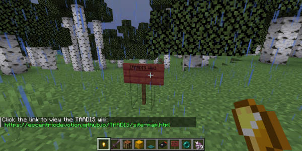

# Wiki Sign

You can set up a sign, that when clicked, shows a clickable URL to the official TARDIS plugin wiki.

- Place a sign with `[TARDIS Wiki]` on the first line.
- Click the sign to display the URL message.
- Click the link to open the URL in your web browser.

Inside your TARDIS, you can also use the TARDIS keyboard:

- Click the TARDIS Keyboard sign.
- Type `wiki` on the first line.
- Close the GUI to display the URL message.